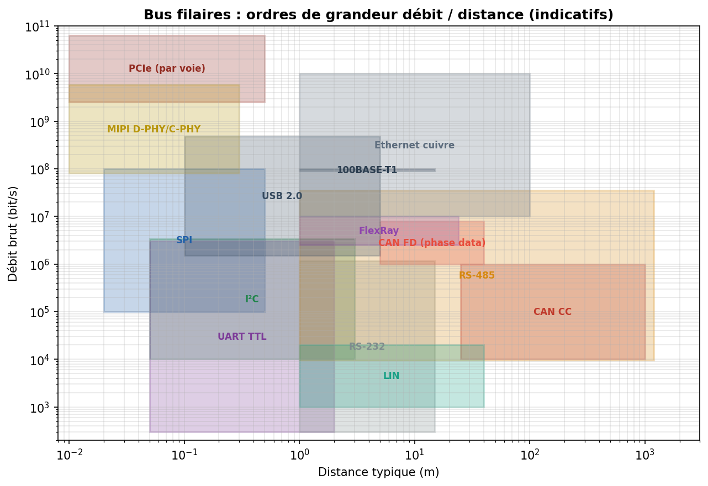
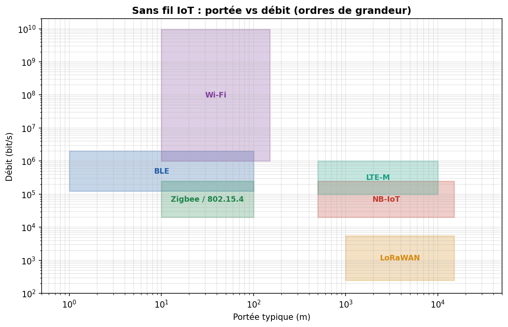
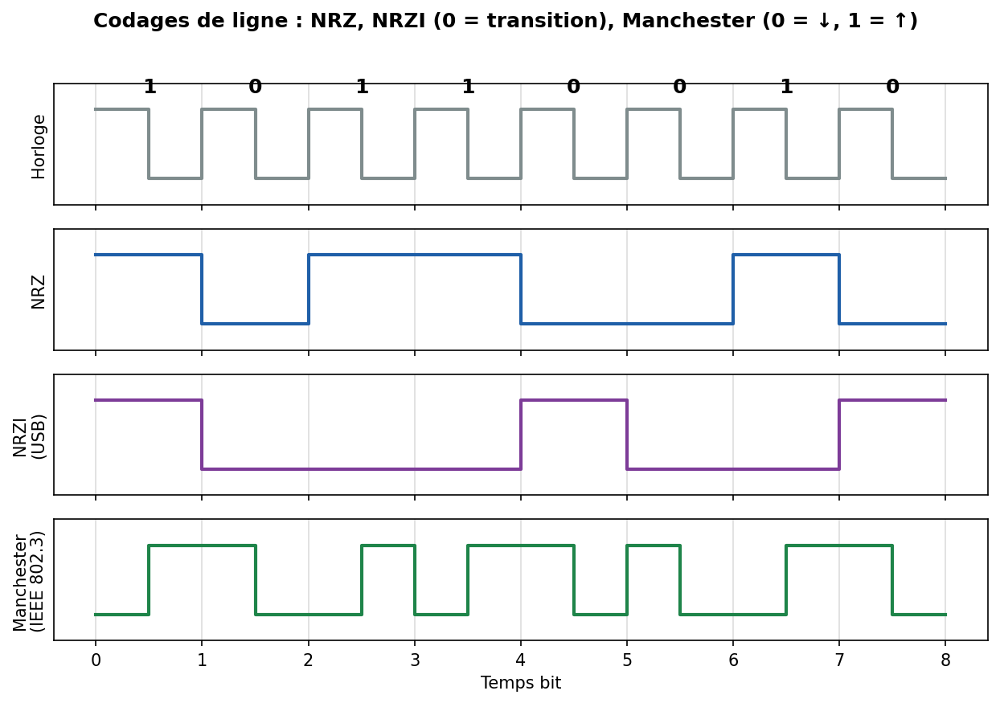
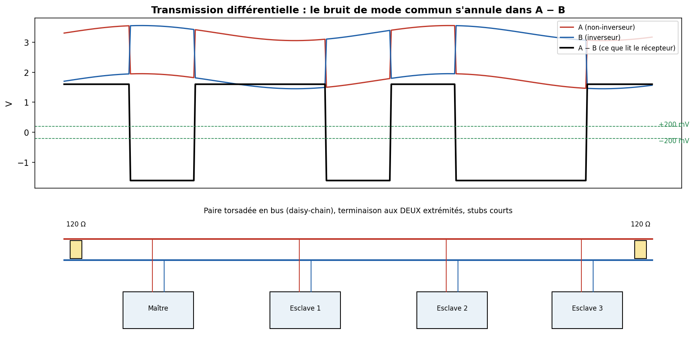
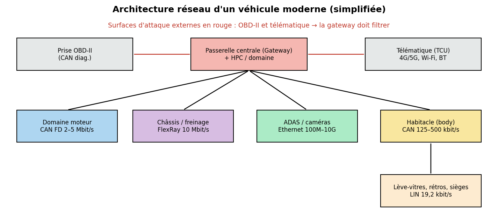

# 00 — Concepts transverses des bus embarqués

> À lire **en premier**. Tous ces concepts reviennent dans chaque fiche protocole.
> Objectif : te donner le vocabulaire et les modèles mentaux pour ne plus jamais confondre SPI et I²C, ou « débit » et « bande passante ».

---

## 1. Qu'est-ce qu'un « bus » ?

Un **bus** est un support de communication **partagé** par plusieurs composants qui échangent des données selon un **protocole** commun. On distingue trois choses qu'on mélange souvent :

- **Le support physique (média)** : fils de cuivre, paire torsadée, fibre, air (RF).
- **La couche physique (PHY)** : niveaux de tension, codage, timing, connecteurs.
- **Le protocole** : format des trames, adressage, arbitrage, détection d'erreur.

Un **protocole** peut vivre sur plusieurs PHY (Modbus tourne sur RS-485 *ou* sur TCP/IP), et une PHY peut porter plusieurs protocoles (Ethernet porte TCP, PROFINET, EtherCAT…).

---

## 2. Les grands axes de classification

### 2.1 Série vs parallèle
- **Série** : les bits passent **un par un** sur un (ou deux) fil(s). Moins de fils, moins de problèmes de *skew* (désynchronisation entre fils), monte plus haut en fréquence. → **UART, SPI, I²C, CAN, USB, PCIe…** Aujourd'hui **quasiment tout est série**.
- **Parallèle** : plusieurs bits **en même temps** sur N fils. Historiquement rapide (bus mémoire, vieux ports imprimante), mais le *skew* limite la fréquence sur de longues distances. Survit surtout **intra-puce** et sur bus mémoire (DDR).

### 2.2 Synchrone vs asynchrone
- **Synchrone** : une ligne d'**horloge** dédiée accompagne les données. L'émetteur dit *quand* lire chaque bit. → **SPI (SCLK), I²C (SCL)**.
- **Asynchrone** : **pas** de fil d'horloge. Émetteur et récepteur ont chacun leur horloge, réglée sur le même **débit (baud rate)** convenu à l'avance ; la synchro se fait sur les fronts (bit START). → **UART, CAN, LIN**.

> ⚠️ Un système asynchrone impose que les deux horloges soient **assez proches** (typiquement < 2–3 % d'écart) sinon le dernier bit d'un octet est mal échantillonné.

### 2.3 Simplex / half-duplex / full-duplex
- **Simplex** : un seul sens (ex. capteur qui ne fait qu'émettre).
- **Half-duplex** : les deux sens mais **pas en même temps** (I²C, RS-485 2 fils, CAN).
- **Full-duplex** : les deux sens **simultanément** (SPI avec MOSI+MISO, UART TX+RX, Ethernet).

### 2.4 Maître/esclave, multi-maître, pair à pair
- **Maître unique** (single-master) : un chef décide de tout le trafic (SPI, I²C classique, LIN).
- **Multi-maître** : plusieurs peuvent initier ; il faut un mécanisme d'**arbitrage** pour gérer les collisions (I²C, CAN).
- **Pair à pair** : nœuds égaux (Ethernet commuté).

> **Note terminologie 2020+** : l'industrie remplace « master/slave » par **controller/peripheral** (SPI, MIPI), **commander/responder** (LIN), **main/secondary**… Le concept est identique.

### 2.5 Topologies
```
Point à point :   [A]────────[B]

Bus / multidrop : ──┬────┬────┬────┬──
                   [A]  [B]  [C]  [D]

Étoile :            [A]
                     │
              [B]──[HUB]──[D]
                     │
                    [C]

Daisy-chain :     [A]→[B]→[C]→[D]   (ex. EtherCAT)

Anneau :          [A]→[B]→[C]→[A]
```

---

## 3. Débit, largeur de bande, et pourquoi « bauds ≠ bits/s »

- **Débit binaire** : bits utiles par seconde (bit/s, kbit/s, Mbit/s).
- **Baud** : nombre de **symboles** par seconde. Si un symbole code 1 bit (cas NRZ), baud = bit/s. Si un symbole code plusieurs bits (modulations QAM du Wi-Fi, PAM du 100BASE-T1), **1 baud > 1 bit**. En UART courant, on dit « 9600 bauds » = 9600 bit/s parce que 1 symbole = 1 bit — mais c'est un abus de langage courant.
- **Débit utile (goodput)** : après retrait de l'overhead (start/stop, en-têtes, CRC, bit-stuffing). Toujours **inférieur** au débit brut.

**Ordres de grandeur — bus filaires :**



**Ordres de grandeur — sans fil IoT :**



---

## 4. Codage de ligne (line coding)

Comment représenter des 0 et des 1 sur le fil ? Ce choix impacte la synchro d'horloge, la composante continue (DC), et l'immunité au bruit.



- **NRZ (Non-Return-to-Zero)** : 1 = niveau haut, 0 = niveau bas. Simple, efficace, mais **une longue suite de bits identiques ne produit aucun front** → le récepteur peut perdre la synchro. Utilisé par UART, SPI, CAN (+ bit-stuffing pour forcer des fronts).
- **NRZI** : on code par **transition** (souvent : 0 = transition, 1 = pas de transition). Utilisé par **USB** (avec bit-stuffing).
- **Manchester** : **une transition au milieu de chaque bit** (0 = ↓, 1 = ↑ selon IEEE 802.3). **Auto-cadencé** (l'horloge est récupérable du signal), pas de composante DC → idéal transfo/isolation. Coût : **double la bande passante**. Utilisé par 10BASE-T, RFID, certains protocoles automobiles.
- **8b/10b, 64b/66b** : codages « équilibrés » des liens très rapides (PCIe, SATA, Ethernet Gbit) qui garantissent assez de transitions et un DC nul, au prix de 20 % (8b/10b) ou 3 % (64b/66b) d'overhead.

---

## 5. Single-ended vs différentiel

- **Single-ended (asymétrique)** : la tension d'un fil est mesurée **par rapport à une masse commune**. Simple et peu de fils (SPI, I²C, UART TTL). Fragile au bruit et aux écarts de masse → **courtes distances**.
- **Différentiel** : l'information est la **différence** entre deux fils (A − B) qui portent des signaux opposés. Le bruit qui frappe les deux fils identiquement (**mode commun**) s'annule à la soustraction. → **longues distances, environnements bruités** : RS-485, CAN, USB, Ethernet, LVDS, FlexRay.



> C'est **la** raison pour laquelle les bus « longue distance » sont différentiels : robustesse au bruit et aux masses flottantes.

---

## 6. Terminaison, réflexions, intégrité du signal

Sur un bus « long » (au sens : longueur du câble comparable à la longueur d'onde du signal), un front qui arrive au bout **se réfléchit** s'il n'y a pas d'adaptation d'impédance, créant des échos qui corrompent les bits.
→ On place des **résistances de terminaison** (typ. 120 Ω pour CAN/RS-485, égales à l'impédance caractéristique de la paire torsadée) **aux deux extrémités** du bus. Les *stubs* (dérivations) doivent rester **courts**.

C'est un point d'examen ET de terrain classique : un bus CAN sans (ou avec trop de) terminaisons = erreurs aléatoires.

---

## 7. Détection & correction d'erreurs

- **Bit de parité** : 1 bit qui rend le nombre de 1 pair (parité paire) ou impair. Détecte 1 erreur, pas 2. (UART option, LIN historique.)
- **Checksum** : somme des octets modulo quelque chose. Simple, faible. (LIN, Modbus ASCII.)
- **CRC (Cyclic Redundancy Check)** : division polynomiale ; détecte les rafales d'erreurs avec une très bonne probabilité. Omniprésent : **CAN (CRC-15), Modbus RTU (CRC-16), Ethernet (CRC-32), USB (CRC-5/CRC-16)**.
- **FEC (Forward Error Correction)** : on ajoute de la redondance permettant de **corriger** sans retransmettre (codes de Hamming, Reed-Solomon, LoRa). Essentiel sur les liens sans fil.
- **ARQ (retransmission)** : on **redemande** en cas d'erreur (TCP, CAN qui rejoue automatiquement une trame en erreur).

---

## 8. Le modèle OSI, version « embarqué »

La plupart des bus embarqués n'implémentent que les couches basses :

| Couche OSI | Rôle | Ce que couvrent les bus |
|---|---|---|
| 1 – Physique | tensions, fronts, connecteurs | SPI, I²C, UART, CAN-PHY, RS-485, PHY Ethernet |
| 2 – Liaison | trames, adressage local, arbitrage, CRC | CAN, LIN, Ethernet MAC, I²C |
| 3 – Réseau | routage entre réseaux | IP, CAN-TP (segmentation), pas natif sur SPI/I²C |
| 4 – Transport | fiabilité bout-à-bout | TCP, UDS/ISO-TP sur CAN |
| 5-7 – Session→Appli | services métier | Modbus, PROFINET, UDS diag, MQTT/CoAP (IoT) |

> Un capteur I²C, c'est essentiellement **couche 1 + un peu de 2**. Un ECU automobile qui fait du diagnostic UDS empile jusqu'à la **couche applicative** au-dessus de CAN.

---

## 9. Contexte véhicule : pourquoi autant de bus différents ?

Un même véhicule mélange des bus **par coût et par criticité** :



- **LIN** (~20 kbit/s) : lève-vitres, rétros, capteurs de pluie — là où CAN serait trop cher.
- **CAN / CAN FD** (0,1–8 Mbit/s) : groupe motopropulseur, carrosserie, diagnostic OBD-II.
- **FlexRay** (10 Mbit/s, déterministe) : châssis, freinage, direction (*x-by-wire*).
- **Automotive Ethernet** (100 Mbit/s – 10 Gbit/s) : caméras, ADAS, infodivertissement.
- **Une passerelle (gateway)** relie ces domaines et **doit filtrer** — c'est le point clé de la sécurité automobile.

---

## 10. Tableau de synthèse « quel bus pour quoi ? »

| Besoin | Bus typiques |
|---|---|
| Capteur/ADC/DAC très proche du MCU, rapide | **SPI** |
| Plusieurs petits capteurs, peu de fils, adressables | **I²C** |
| Debug / console / GPS / modem série | **UART** |
| Un seul fil, capteur de température, ID unique | **1-Wire** |
| Réseau robuste multi-nœuds, automobile/indus | **CAN / CAN FD** |
| Sous-réseau automobile bas coût | **LIN** |
| Automobile critique, déterministe | **FlexRay** |
| Liaison longue distance industrielle | **RS-485 / Modbus** |
| Fond de panier automate temps réel | **EtherCAT / PROFINET** |
| Périphérique PC, haut débit, hot-plug | **USB** |
| Très haut débit interne (SSD, GPU, FPGA) | **PCIe** |
| Caméra / écran vers SoC | **MIPI CSI/DSI** |
| Objet connecté sur pile, courte portée | **BLE / Zigbee** |
| Objet connecté longue portée basse conso | **LoRaWAN / NB-IoT** |

---

## Sources (concepts généraux)

- Analog Devices — *A Beginner's Guide to Digital Signal Processing* & guides d'interface : <https://www.analog.com/en/resources/technical-articles.html>
- Texas Instruments — *Comparing Bus Solutions* (SLLA067) et notes RS-485 : <https://www.ti.com/interface/overview.html>
- Wikipedia — *Serial communication*, *Line code*, *Differential signaling*, *OSI model* (bons points de départ, vérifier les sources primaires) : <https://en.wikipedia.org/wiki/Serial_communication>
- Sparkfun — *Serial Communication* (tutoriel pédagogique) : <https://learn.sparkfun.com/tutorials/serial-communication>
- Ben Eater (YouTube) — séries sur la communication série et les bus, excellent pour l'intuition électronique : <https://eater.net/>
