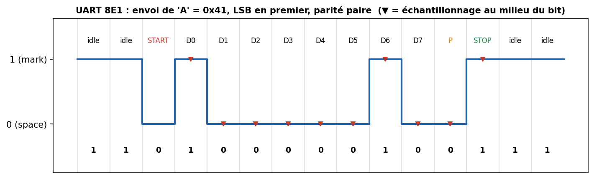
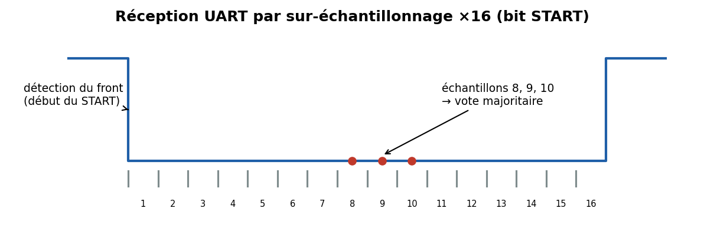

# 01 — UART / RS-232

> Le plus vieux et le plus simple des liens série. Encore partout : consoles de debug, GPS, modems GSM/LoRa, Bluetooth classique, bootloaders. **Point d'entrée n°1 en sécurité matérielle.**

---

## Carte d'identité

| Caractéristique | Valeur |
|---|---|
| Type | Série, **asynchrone**, full-duplex |
| Fils | **2** (TX, RX) + masse ; parfois RTS/CTS pour contrôle de flux |
| Horloge | **Aucune** — débit convenu à l'avance |
| Topologie | **Point à point** (1 émetteur ↔ 1 récepteur) |
| Débits usuels | 9 600 · 19 200 · 38 400 · 57 600 · **115 200** bit/s (jusqu'à ~3 Mbit/s) |
| Distance | ~1 m en TTL, ~15 m en RS-232, +1 km en RS-485 |
| Adressage | **Aucun** (liaison dédiée) |
| Détection d'erreur | Bit de **parité** optionnel |

> **UART** (Universal Asynchronous Receiver/Transmitter) est le **périphérique matériel** dans le MCU. **RS-232 / RS-422 / RS-485** sont des **normes électriques** (niveaux de tension) qui transportent la même trame UART. « UART » désigne aussi, par abus, le protocole lui-même.

---

## 1. Le problème que ça résout

Relier deux puces avec le **minimum de fils et de logique**, sans partager d'horloge. Comme il n'y a pas de fil d'horloge, les deux extrémités doivent être **configurées identiquement** : débit, nombre de bits, parité, bits de stop. La fameuse notation **`115200 8N1`** = 115200 bit/s, **8** bits de données, parité **N**one, **1** bit de stop.

---

## 2. La trame, bit à bit



Au **repos (idle)**, la ligne est à l'état **haut (mark, '1')**. Une transmission d'un octet se déroule ainsi :

1. **Bit START** : la ligne passe à **0** pendant 1 temps-bit. Ce **front descendant** réveille le récepteur.
2. **Bits de données** : 5 à 9 bits, **LSB en premier** (le bit de poids faible sort d'abord).
3. **Bit de parité** (optionnel) : pair (E), impair (O), ou absent (N).
4. **Bit(s) STOP** : 1, 1,5 ou 2 temps-bit à **1**, pour garantir un front avant l'octet suivant.

Exemple : envoyer `'A' = 0x41 = 0100 0001b`. LSB first → on transmet `1,0,0,0,0,0,1,0`. Parité paire : trois `1`… non, deux `1` → parité = 0.

---

## 3. Comment le récepteur « retrouve » les bits sans horloge

C'est le cœur de l'UART. Le récepteur tourne à une horloge **N fois plus rapide** que le débit (typiquement **×16**). Il :



1. **détecte le front descendant** du START,
2. **attend un demi-bit** pour se placer au **milieu** du premier bit,
3. **échantillonne au centre** de chaque bit (souvent en votant sur les échantillons 7-8-9 sur 16 pour filtrer le bruit),
4. **se re-synchronise à chaque octet** sur le START suivant.

→ D'où la contrainte : l'écart d'horloge cumulé sur ~10 bits doit rester **< un demi-bit**, soit une tolérance d'environ **±2 à 3 %**. C'est pourquoi les MCU utilisent souvent un **quartz** plutôt qu'un oscillateur RC interne pour l'UART à haut débit.

---

## 4. Niveaux électriques : TTL vs RS-232

| | UART TTL/CMOS | RS-232 |
|---|---|---|
| '1' (mark) | +3,3 V ou +5 V | **−3 à −15 V** |
| '0' (space) | 0 V | **+3 à +15 V** |
| Logique | directe | **inversée** + tension négative |
| Distance | ~1–2 m | ~15 m |

⚠️ **Piège classique** : brancher directement une sortie RS-232 (±12 V) sur une entrée MCU TTL 3,3 V = **destruction**. Il faut un transceiver (ex. **MAX232**) qui convertit les niveaux.

Le **contrôle de flux** matériel utilise **RTS/CTS** (Request/Clear To Send) pour éviter de saturer un récepteur lent ; le contrôle logiciel utilise les caractères **XON/XOFF**.

---

## 5. Aspects poussés

- **Erreurs remontées par le périphérique UART** : *framing error* (bit STOP attendu à 1 mais lu à 0 → mauvais débit ou bruit), *parity error*, *overrun* (octet non lu à temps, écrasé), *break* (ligne maintenue à 0 anormalement longtemps).
- **FIFO & DMA** : les UART modernes ont des **FIFO** (ex. 16 octets du 16550) et se couplent au **DMA** pour transférer sans CPU. Sans FIFO, à 115200 bauds, il faut servir l'interruption toutes les ~87 µs.
- **Auto-baud** : certains bootloaders mesurent la durée d'un caractère connu (souvent `0x55 = 0101 0101`, riche en fronts) pour **deviner le débit** — même principe que le champ Sync de LIN.
- **9-bit / multidrop** : un 9ᵉ bit peut servir à distinguer « adresse » et « donnée » sur un bus multipoint (RS-485).

---

## 6. Sécurité 🔒

L'UART est **la porte d'entrée n°1** en sécurité matérielle embarquée, parce que les fabricants laissent très souvent une **console de debug** active.

**Surface d'attaque**
- **Console shell / bootloader** exposée : U-Boot, root shell Linux, logs verbeux sur des **pastilles ou header non documentés** de la carte.
- **Aucune authentification, aucun chiffrement** par nature : quiconque a un adaptateur USB-TTL lit tout.
- **Injection** : si un shell est actif, on tape des commandes ; on peut interrompre le boot (`Ctrl-C`, touche pour U-Boot) et modifier les variables d'environnement, charger un firmware, dumper la flash.

**Méthodologie d'attaque/audit (défensif)**
1. **Repérer** les 4 pastilles TX/RX/GND/VCC (souvent alignées) — à l'oscilloscope ou au multimètre (GND = continuité avec le plan de masse ; TX = ligne à ~3,3 V au repos qui « bouge » au boot).
2. **Deviner le débit** (analyseur logique + mesure du bit le plus court, ou balayage 9600→115200).
3. Se connecter avec un **adaptateur USB-UART** (FT232, CP2102, CH340) et un terminal (`minicom`, `screen`, `picocom`, PuTTY).
4. Observer le boot, chercher un prompt, tenter d'interrompre le bootloader.

**Contre-mesures**
- **Désactiver la console** en production (fusible, config bootloader), ou au moins l'**authentifier** (mot de passe U-Boot, `CONFIG_...` de verrouillage).
- **Réduire la verbosité** des logs (pas de clés, pas de chemins internes).
- **Boot sécurisé (secure boot)** : signer le firmware pour qu'un binaire modifié ne démarre pas.
- **Retirer/masquer** les points de test, ou couper physiquement les vias en prod.

---

## 7. Pratique — matériel & outils

| Besoin | Outil |
|---|---|
| Adaptateur USB↔UART | FT232RL, CP2102, CH340G (~2–5 €) |
| Terminal série | `screen /dev/ttyUSB0 115200`, `minicom`, `picocom`, PuTTY |
| Voir les trames | analyseur logique (**Saleae**, clone **FX2** ~10 €) + **PulseView/sigrok** (décodeur UART intégré) |
| Détecter les pins | **JTAGulator**, ou multimètre + oscillo |
| Auto-débit | PulseView (mesure la largeur du bit) |

Commande type Linux :
```bash
# lister les ports
ls /dev/ttyUSB* /dev/ttyACM*
# ouvrir une console 115200 8N1
picocom -b 115200 /dev/ttyUSB0
```

---

## 8. Sources

- **Wikipedia — UART** : <https://en.wikipedia.org/wiki/Universal_asynchronous_receiver-transmitter>
- **Sparkfun — Serial Communication** (très pédagogique, chronogrammes) : <https://learn.sparkfun.com/tutorials/serial-communication>
- **Texas Instruments — RS-232 / RS-485 design notes** (SLLA070, SNLA…) : <https://www.ti.com/interface/rs-232-rs-422-rs-485/overview.html>
- **NXP/Maxim — MAX232 datasheet** : <https://www.analog.com/media/en/technical-documentation/data-sheets/MAX220-MAX249.pdf>
- **sigrok / PulseView** (décodage UART) : <https://sigrok.org/wiki/Protocol_decoder:Uart>
- **Norme TIA/EIA-232-F** (RS-232) — spec officielle payante ; résumé libre chez TI.
- Sécurité : **Hardware Hacking / hardwear.io**, et le livre *The Hardware Hacking Handbook* (Woudenberg & O'Flynn, 2021).
