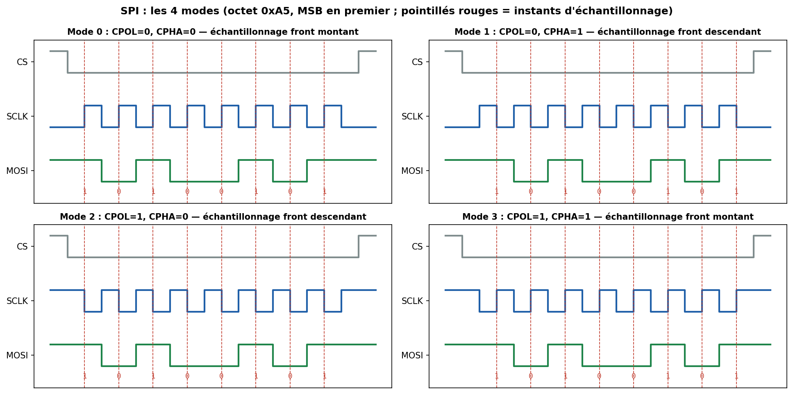

# 02 — SPI (Serial Peripheral Interface)

> Le bus synchrone rapide « de proximité ». Écrans, mémoires flash, ADC/DAC, capteurs haut débit, modules radio (nRF24, LoRa SX127x). Pas d'adressage : on sélectionne par un fil dédié.

---

## Carte d'identité

| Caractéristique | Valeur |
|---|---|
| Type | Série, **synchrone**, **full-duplex** |
| Fils | **4** : SCLK, MOSI, MISO, CS (+ 1 CS par esclave) |
| Rôles | 1 **maître (controller)**, 1..N **esclaves (peripherals)** |
| Horloge | Fournie par le **maître** (SCLK) |
| Débit | typiquement **1–50 MHz**, jusqu'à >100 MHz (QSPI, flash) |
| Distance | **quelques cm** (intra-carte) |
| Adressage | **Aucun** — sélection par **Chip Select** matériel |
| Détection d'erreur | **Aucune** native (à ajouter au niveau applicatif) |

---

## 1. Le problème que ça résout

Échanger des données **vite** entre un MCU et un périphérique proche, en **full-duplex** (émission et réception simultanées), sans la complexité d'un adressage. Le prix à payer : **un fil CS par esclave** et **aucune** vérification d'erreur intégrée.

---

## 2. Les 4 signaux



- **SCLK** (Serial Clock) : horloge générée par le maître. Chaque coup d'horloge = 1 bit échangé.
- **MOSI** (Master Out, Slave In) : données maître → esclave.
- **MISO** (Master In, Slave Out) : données esclave → maître.
- **CS / SS** (Chip/Slave Select) : **actif bas** en général. Le maître tire CS à 0 pour parler à **cet** esclave.

> Nouvelle nomenclature (2020+, poussée par l'OSHWA) : **SCLK, SDO/SDI** ou **COPI/CIPO** (Controller Out Peripheral In / Controller In Peripheral Out) et **CS**. Tu verras encore MOSI/MISO partout dans les datasheets.

Le principe interne est un **registre à décalage circulaire** : à chaque coup d'horloge, le maître **sort** un bit sur MOSI **et entre** un bit sur MISO **en même temps**. Après 8 coups d'horloge, maître et esclave ont **échangé** un octet. → il n'y a pas de « lecture pure » : pour lire, on écrit un octet bidon (*dummy*).

---

## 3. Les 4 modes : CPOL & CPHA (LE point d'examen)

Deux paramètres définissent **quand** le bit est présenté et **quand** il est échantillonné :

- **CPOL** (Clock Polarity) : niveau de l'horloge **au repos**. 0 = repos bas, 1 = repos haut.
- **CPHA** (Clock Phase) : sur quel **front** on échantillonne. 0 = premier front, 1 = second front.

| Mode | CPOL | CPHA | Repos SCLK | Échantillonnage | Changement de donnée |
|------|------|------|------------|-----------------|----------------------|
| **0** | 0 | 0 | bas | front **montant** | front descendant |
| **1** | 0 | 1 | bas | front **descendant** | front montant |
| **2** | 1 | 0 | haut | front **descendant** | front montant |
| **3** | 1 | 1 | haut | front **montant** | front descendant |

> **Règle mnémotechnique** : si `CPHA = 0`, on échantillonne sur le **1er** front (donc la donnée doit être stable **avant** le 1er front → l'esclave la présente sur le front d'activation du CS). Si `CPHA = 1`, on échantillonne sur le **2ᵉ** front.

**Mode 0** est le plus répandu. Un mismatch de mode entre maître et esclave = données **décalées d'un demi-bit** → octets faux. C'est le premier truc à vérifier quand « ça ne marche pas ».

---

## 4. Câblages multi-esclaves

**Multi-CS (le plus courant)** : un CS dédié par esclave. Le maître active un seul CS à la fois.
```
            ┌─ SCLK ─┬────────┬────────┐
   MAÎTRE ──┼─ MOSI ─┼────────┼────────┤
            ├─ MISO ─┴────────┴────────┤   (les MISO sont partagés :
            │  CS1 ───► Esclave A       │    l'esclave non sélectionné
            │  CS2 ───► Esclave B       │    met son MISO en haute impédance)
            │  CS3 ───► Esclave C       │
```
⚠️ Un esclave non sélectionné **doit** mettre sa sortie MISO en **haute impédance (tri-state)**, sinon il « pollue » le bus. Tous les composants SPI ne le font pas correctement → parfois un buffer tri-state externe.

**Daisy-chain (chaînage)** : les esclaves sont mis en série (MISO de l'un → MOSI du suivant). Un seul CS pour tous, mais il faut décaler les données. Utilisé pour les chaînes de LED (registres à décalage 74HC595), certains DAC.

---

## 5. Aspects poussés

- **Vitesse & intégrité** : au-delà de ~20–30 MHz, la longueur des pistes, les capacités et le *skew* comptent. On soigne les impédances, on ajoute parfois des résistances série sur SCLK.
- **QSPI / Dual-SPI (flash)** : pour lire une flash NOR plus vite, on utilise **2 ou 4 lignes de données** en parallèle (MOSI/MISO deviennent bidirectionnels). C'est le mode **XIP (eXecute In Place)** : le CPU exécute directement le code depuis la flash SPI. → surface d'attaque importante (voir sécurité).
- **Pas d'accusé de réception** : le maître **ne sait pas** si l'esclave a compris. La fiabilité repose sur l'applicatif (registre d'état, CRC logiciel).
- **Latence CS** : certains esclaves exigent un délai entre l'activation du CS et le premier coup d'horloge (t_CSS) → à lire dans la datasheet.

---

## 6. Sécurité 🔒

**Surface d'attaque**
- **Sniffing trivial** : 4 pastilles, un analyseur logique, et on lit tout le trafic en clair. Aucun chiffrement natif.
- **Dump de flash SPI** : la **mémoire de boot** est souvent une flash SPI externe (25xx). On peut la **désouder** (ou l'attaquer *in-circuit* avec un clip **SOIC-8**) et lire tout le firmware avec un **programmateur** (CH341A, Bus Pirate, flashrom). → extraction du firmware = rétro-ingénierie, recherche de clés/mots de passe en dur, de vulnérabilités.
- **Injection / glitch** : couper CS ou injecter sur MISO pendant le boot pour faire lire à la flash autre chose (*fault injection*).
- **Man-in-the-middle** sur le bus SPI (rare mais fait en recherche : intercalage FPGA).

**Contre-mesures**
- **Chiffrer le firmware** en flash (déchiffré à la volée par le SoC, ex. *flash encryption* ESP32, *OTP keys*).
- **Secure boot** : le SoC vérifie une **signature** avant d'exécuter le code lu en SPI.
- **Ne pas stocker de secrets en clair** dans la flash SPI. Utiliser un **élément sécurisé** (ATECC608, secure enclave) pour les clés.
- **Authentifier** les échanges applicatifs si l'esclave est sensible.

> Pour un audit, **dumper la flash SPI puis l'analyser avec `binwalk`** est l'un des premiers réflexes en rétro-ingénierie de firmware.

---

## 7. Pratique — matériel & outils

| Besoin | Outil |
|---|---|
| Sniffer le bus | Analyseur logique (Saleae / FX2) + **PulseView** (décodeur SPI) |
| Parler en SPI depuis un PC | **Bus Pirate**, FT2232H, Raspberry Pi (`spidev`) |
| Dumper une flash SPI | **CH341A** + clip SOIC-8, ou **flashrom** |
| Analyser un dump | `binwalk -e firmware.bin`, `strings`, Ghidra |

```bash
# lecture d'une flash SPI 25xx avec flashrom (programmateur CH341A)
flashrom -p ch341a_spi -r dump.bin
binwalk -e dump.bin        # extraire les systèmes de fichiers, clés, etc.
```

---

## 8. Sources

- **Analog Devices — Introduction to SPI Interface** (Piyu Dhaker) : <https://www.analog.com/en/analog-dialogue/articles/introduction-to-spi-interface.html>
- **Motorola/NXP — SPI Block Guide** (spec d'origine) : rechercher « SPI Block Guide V03.06 » (NXP).
- **Sparkfun — SPI tutorial** : <https://learn.sparkfun.com/tutorials/serial-peripheral-interface-spi>
- **sigrok — décodeur SPI** : <https://sigrok.org/wiki/Protocol_decoder:Spi>
- **OSHWA — Resolved Language (COPI/CIPO)** : <https://www.oshwa.org/a-resolution-to-redefine-spi-signal-names/>
- **flashrom** (dump de flash) : <https://www.flashrom.org/>
- **binwalk** : <https://github.com/ReFirmLabs/binwalk>
