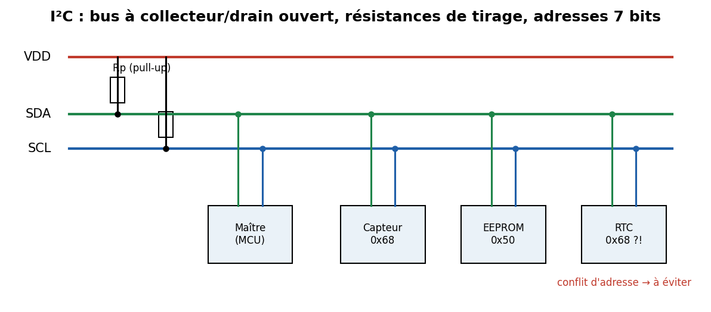
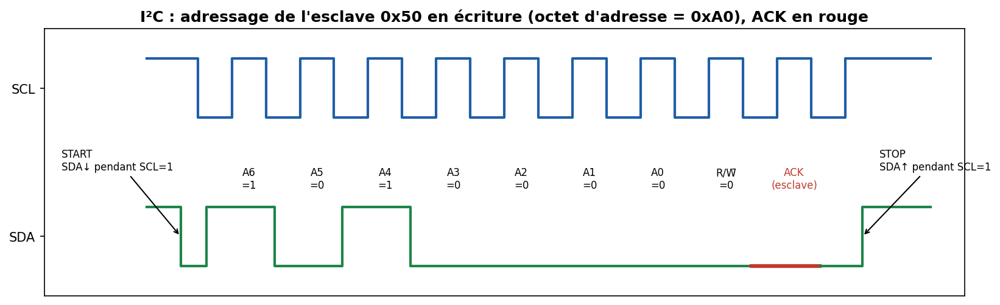

# 03 — I²C / SMBus

> Deux fils, une dizaine de composants, adressage intégré. Le bus des capteurs (température, accéléromètre, EEPROM, RTC). Plus lent que SPI, mais bien plus économe en broches.

---

## Carte d'identité

| Caractéristique | Valeur |
|---|---|
| Type | Série, **synchrone**, **half-duplex** |
| Fils | **2** : SDA (données), SCL (horloge) + masse |
| Rôles | **multi-maître** possible ; maître(s) + esclaves adressés |
| Électrique | **drain/collecteur ouvert** + résistances de **pull-up** |
| Adressage | **7 bits** (128 adresses, dont réservées) ou **10 bits** |
| Débits | Standard **100 kHz**, Fast **400 kHz**, Fast+ **1 MHz**, High-speed **3,4 MHz** |
| Distance | ~1 m (limité par la capacité du bus, ~400 pF) |
| Détection d'erreur | **ACK/NACK** par octet (pas de CRC, sauf SMBus PEC) |
| Inventeur | **Philips** (1982), aujourd'hui **NXP** ; brevet expiré |

---

## 1. Le problème que ça résout

Connecter **plusieurs** composants avec seulement **2 fils partagés**, chacun ayant une **adresse**. Contrairement à SPI (1 CS par esclave), on ajoute des composants **sans ajouter de fils** — juste une adresse différente.

---

## 2. Électrique : le « open-drain » et les pull-ups (fondamental)



Chaque nœud ne peut que **tirer la ligne à 0** (transistor vers la masse) ou la **relâcher** (haute impédance). Ce sont les **résistances de pull-up (Rp)** qui ramènent la ligne à 1 quand personne ne tire.

Conséquences majeures :
- **ET câblé (wired-AND)** : si un seul nœud tire à 0, la ligne est à 0. Ce comportement est **la base de l'arbitrage et du clock stretching** (voir plus bas).
- **Pas de court-circuit** possible si deux nœuds « parlent » en même temps (contrairement à des sorties push-pull).
- **Choix de Rp** : trop grande → fronts montants lents (RC), débit limité ; trop petite → courant excessif. On calcule Rp selon la capacité du bus et la vitesse (typiquement 2,2–4,7 kΩ à 100–400 kHz).

---

## 3. La transaction, condition par condition



Règle d'or : **SDA ne change QUE lorsque SCL est bas.** Les seules exceptions (SDA bouge pendant que SCL est haut) sont les conditions **START** et **STOP** — c'est ce qui les rend reconnaissables.

1. **START (S)** : le maître fait passer **SDA de 1 à 0 pendant que SCL est à 1**. Le bus est désormais occupé.
2. **Octet d'adresse** : 7 bits d'adresse **MSB first**, puis 1 bit **R/W̄** (0 = écriture, 1 = lecture). Donc l'octet réellement transmis = `adresse << 1 | R/W`. → une EEPROM à l'adresse 7 bits `0x50` reçoit l'octet `0xA0` en écriture, `0xA1` en lecture.
3. **ACK/NACK** : après chaque octet, l'**émetteur relâche SDA** et le **récepteur** tire SDA à 0 pour dire **ACK** (« reçu »). S'il laisse SDA à 1 → **NACK** (pas d'esclave à cette adresse, ou refus).
4. **Octets de données** : 8 bits + ACK, autant de fois que nécessaire.
5. **Repeated START (Sr)** : au lieu d'un STOP, le maître refait un START — utile pour enchaîner « écrire l'adresse du registre » puis « lire sa valeur » **sans libérer le bus** (évite qu'un autre maître s'intercale).
6. **STOP (P)** : **SDA de 0 à 1 pendant que SCL est à 1**. Bus libéré.

---

## 4. Aspects poussés

### 4.1 Clock stretching
Un esclave lent peut **maintenir SCL à 0** après un octet pour dire « attends, je ne suis pas prêt ». Le maître, qui surveille SCL (grâce au wired-AND), **attend** que SCL remonte. Puissant, mais **mal supporté** par certains contrôleurs matériels → source de bugs.

### 4.2 Arbitrage multi-maître
Comme sur CAN, deux maîtres qui démarrent ensemble s'arbitrent **bit à bit sur SDA** : celui qui émet un 1 mais **lit un 0** sur le bus a perdu → il se retire **sans corruption** de données. Le gagnant ne sait même pas qu'il y a eu conflit.

### 4.3 Conflits d'adresses (le piège terrain)
L'espace d'adresses 7 bits est petit. Beaucoup de capteurs ont une adresse **fixe** ou **2-3 choix** par pontage. Deux composants identiques = **collision** → il faut un **multiplexeur I²C** (TCA9548A) ou des bus séparés.
Adresses **réservées** : `0x00` (general call), `0x00-0x07` et `0x78-0x7F`.

### 4.4 SMBus & PEC
**SMBus** (System Management Bus, Intel) est un sur-ensemble strict d'I²C utilisé pour la gestion (batteries, capteurs PC). Il ajoute des **timeouts** (pas de clock stretching infini), des formats de commande normalisés, et un **PEC** (Packet Error Code = CRC-8 optionnel) → une des rares façons d'avoir de la **détection d'erreur** sur I²C. **PMBus** en dérive pour l'alimentation.

### 4.5 I3C (la relève)
**MIPI I3C** modernise I²C : jusqu'à ~12,5 Mbit/s, **interruptions in-band** (plus besoin d'un fil IRQ par capteur), attribution dynamique d'adresses, rétro-compatibilité I²C. À connaître, ça arrive dans les SoC récents.

---

## 5. Sécurité 🔒

**Surface d'attaque**
- **Sniffing** simple (2 fils, analyseur logique, décodeur I²C).
- **EEPROM de configuration** : beaucoup d'appareils stockent en I²C une EEPROM 24Cxx contenant **configuration, calibration, clés, numéros de série**. On peut la lire/écrire *in-circuit* → **modifier la config** (débrider un appareil, changer une région, falsifier une calibration).
- **Injection / spoofing** : maîtriser le bus pour **usurper un capteur** (renvoyer de fausses valeurs à l'ECU/MCU) ou un **secure element mal implémenté**.
- **Glitch** sur SDA/SCL pendant une lecture sensible.

**Contre-mesures**
- **Authentifier** les composants critiques (secure elements type ATECC608 qui font du challenge-response, pas juste du stockage).
- **PEC (SMBus)** pour détecter la corruption/injection accidentelle (pas une protection crypto).
- **Chiffrer** le contenu d'une EEPROM sensible ; ne pas y mettre de secret en clair.
- **Détection d'anomalie** : un MCU peut vérifier la cohérence des valeurs capteurs.

---

## 6. Pratique — matériel & outils

| Besoin | Outil |
|---|---|
| Scanner les adresses | `i2cdetect -y 1` (Raspberry Pi), Bus Pirate, Arduino i2c_scanner |
| Lire/écrire un registre | `i2cget`, `i2cset` (paquet `i2c-tools`) |
| Sniffer | Analyseur logique + PulseView (décodeur I²C) |
| Dumper une EEPROM | Bus Pirate, CH341A (mode I²C), `i2cdump` |

```bash
# Raspberry Pi : bus 1
i2cdetect -y 1                 # carte des adresses présentes
i2cdump  -y 1 0x50             # dump complet d'une EEPROM 24Cxx
i2cget   -y 1 0x68 0x00        # lire le registre 0x00 d'une RTC DS3231
```

---

## 7. Sources

- **NXP — UM10204, I²C-bus specification and user manual** (LE document de référence) : <https://www.nxp.com/docs/en/user-guide/UM10204.pdf>
- **Sparkfun — I²C tutorial** : <https://learn.sparkfun.com/tutorials/i2c>
- **TI — Understanding the I²C Bus (SLVA704)** : <https://www.ti.com/lit/an/slva704/slva704.pdf>
- **SMBus spec (System Management Interface Forum)** : <http://smbus.org/specs/>
- **MIPI I3C** : <https://www.mipi.org/specifications/i3c-sensor-specification>
- **sigrok — décodeur I²C** : <https://sigrok.org/wiki/Protocol_decoder:I2c>
- **i2c-tools** : <https://i2c.wiki.kernel.org/index.php/I2C_Tools>
