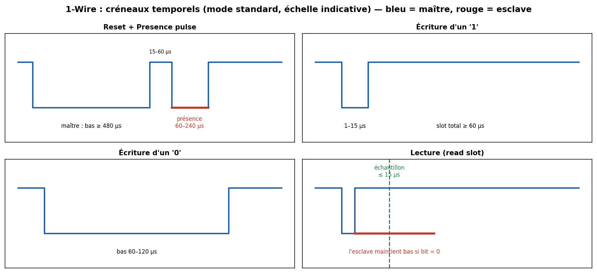

# 04 — 1-Wire

> Un seul fil de données (et parfois même pas de fil d'alimentation !). Le bus des sondes de température **DS18B20**, des iButton, de l'authentification bas coût. Timing serré, adressage 64 bits unique par composant.

---

## Carte d'identité

| Caractéristique | Valeur |
|---|---|
| Type | Série, **asynchrone**, half-duplex, **maître unique** |
| Fils | **1** (données) + masse ; **alimentation parasite** possible sur ce même fil |
| Horloge | Aucune — tout repose sur des **durées d'impulsion** |
| Adressage | **ROM 64 bits** gravée en usine (unique au monde) |
| Débit | ~**16,3 kbit/s** (standard), ~**125 kbit/s** (overdrive) |
| Distance | quelques m à ~100 m (selon topologie et débit) |
| Électrique | **open-drain** + pull-up (~4,7 kΩ) |
| Inventeur | **Dallas Semiconductor** (→ Maxim → Analog Devices) |

---

## 1. Le problème que ça résout

Communiquer avec des composants **avec le moins de fils possible** — idéalement **un seul** — tout en les **identifiant** individuellement. Chaque puce 1-Wire porte un **numéro de série 64 bits unique** gravé en usine, ce qui en fait aussi une brique d'**authentification/identification** (bracelets iButton, cartouches, accessoires « originaux »).

L'astuce célèbre : l'**alimentation parasite** (*parasite power*). Le composant se recharge sur un petit condensateur interne pendant que la ligne est à 1, ce qui permet de fonctionner avec **seulement data + GND**.

---

## 2. Couche physique & timing (le cœur du sujet)

Il n'y a pas d'horloge : **toute l'information est dans la durée des impulsions**. Le **maître** initie chaque créneau (*time slot*) en tirant la ligne à 0 ; la durée pendant laquelle elle reste basse encode le bit.



- **Reset + Presence** : le maître tire la ligne bas **≥ 480 µs**, relâche ; les esclaves répondent par une **impulsion de présence** (bas 60–240 µs). → « qui est là ? ».
- **Écrire un '1'** : maître bas **1–15 µs** puis relâche (l'esclave lit « haut »).
- **Écrire un '0'** : maître bas **60–120 µs** (l'esclave lit « bas »).
- **Lire un bit** : maître tire bas ~1 µs puis relâche et **échantillonne à ≤ 15 µs** ; si l'esclave veut transmettre un 0, **il maintient la ligne basse**.

Un **slot** dure au total ≥ 60 µs. Le mode **overdrive** divise ces durées par ~8. Ces marges sont critiques : un timing raté = bit faux, d'où l'usage de timers matériels ou de bit-banging soigné.

---

## 3. La ROM 64 bits & le protocole

Chaque composant contient une **ROM de 64 bits** :
```
[ 8 bits family code ][ 48 bits numéro de série unique ][ 8 bits CRC-8 ]
```
- **Family code** : type de composant (0x28 = DS18B20, 0x01 = iButton DS1990…).
- **48 bits** : identifiant unique → 2⁴⁸ possibilités.
- **CRC-8** : vérifie l'intégrité de la ROM.

**Commandes ROM** typiques :
- `Read ROM (0x33)` : lit l'ID (si **un seul** esclave).
- `Match ROM (0x55)` : « je parle à CET ID » (sélection sur bus multi-composant).
- `Skip ROM (0xCC)` : « je parle à tous » (broadcast, si un seul esclave).
- `Search ROM (0xF0)` : **algorithme de découverte** qui, par une recherche en arbre binaire bit à bit, énumère **tous** les ID présents sur le bus (gère les collisions en explorant les deux branches quand un bit diffère).

Après la phase ROM viennent les **commandes fonction** propres au composant (ex. `Convert T (0x44)` puis `Read Scratchpad (0xBE)` sur un DS18B20).

---

## 4. Aspects poussés

- **Alimentation parasite** : fonctionne, mais pendant une conversion de température gourmande, il faut un **pull-up fort actif** (MOSFET) pour fournir le courant → à soigner sinon lectures erronées.
- **Topologie & réflexions** : en étoile ou sur longues distances, les réflexions cassent le timing. Maxim recommande des topologies **linéaires** et fournit des notes d'application (AN148, AN244) sur les bus longs.
- **Overdrive** : ×8 en débit mais timing encore plus serré → plus sensible au bruit.
- **Authentification** : les DS28E / DS1961S ajoutent du **SHA-1/SHA-256 challenge-response** → 1-Wire devient un **secure element** bas coût (accessoires « authentiques », consommables).

---

## 5. Sécurité 🔒

C'est un cas d'école intéressant parce que 1-Wire est **souvent utilisé POUR la sécurité** (authentification d'accessoires) autant qu'il en est la cible.

**Surface d'attaque**
- **Clonage d'ID** : si l'authentification se réduit à lire un **ID 64 bits** (`Read ROM`), il suffit de le **rejouer** avec un composant émulé (microcontrôleur qui « fait le DS18B20 »). → contournement des systèmes « accessoire original » naïfs.
- **Sniffing** : un seul fil, timing lisible à l'analyseur logique → on capture tout le dialogue.
- **Émulation complète** : un MCU peut émuler n'importe quel esclave 1-Wire (bibliothèques `OneWireHub`).

**Contre-mesures**
- **Challenge-response cryptographique** (DS28E15/DS28E38 avec SHA-256/ECDSA) : l'ID seul ne suffit plus, il faut prouver la connaissance d'une clé **sans la révéler** → le rejeu ne marche plus.
- **Secrets par appareil** (pas une clé maître unique clonable une fois pour toutes).
- Côté attaque physique, ces secure elements visent aussi à résister aux attaques par canaux auxiliaires — mais restent des composants **bas coût**, donc pas au niveau d'un vrai HSM.

---

## 6. Pratique — matériel & outils

| Besoin | Outil |
|---|---|
| Piloter 1-Wire | Raspberry Pi (`w1-gpio`), Arduino + lib **OneWire** |
| Adaptateur USB | **DS9490R** (USB↔1-Wire officiel) |
| Émuler un esclave | **OneWireHub** (lib Arduino) |
| Sniffer | Analyseur logique (le décodeur 1-Wire existe dans sigrok) |

```bash
# Raspberry Pi avec DS18B20 (driver noyau w1)
modprobe w1-gpio w1-therm
ls /sys/bus/w1/devices/          # 28-xxxxxxxxxxxx = ton capteur
cat /sys/bus/w1/devices/28-*/w1_slave   # température brute
```

---

## 7. Sources

- **Analog Devices (Maxim) — 1-Wire overview & tutorials** : <https://www.analog.com/en/resources/technical-articles/1wire-communication-through-software.html>
- **DS18B20 datasheet** (le grand classique) : <https://www.analog.com/media/en/technical-documentation/data-sheets/DS18B20.pdf>
- **Maxim AN187 — 1-Wire Search Algorithm** : <https://www.analog.com/en/resources/app-notes/1wire-search-algorithm.html>
- **Maxim AN148 / AN244 — bus longs / guidelines** : <https://www.analog.com/en/resources/app-notes/guidelines-for-reliable-long-line-1wire-networks.html>
- **OneWire (Arduino)** : <https://www.pjrc.com/teensy/td_libs_OneWire.html>
- **OneWireHub (émulation d'esclaves)** : <https://github.com/orgua/OneWireHub>
- **sigrok — décodeur 1-Wire** : <https://sigrok.org/wiki/Protocol_decoder:Onewire_link>
