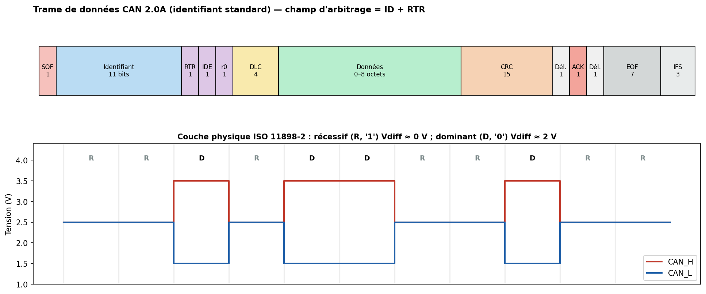
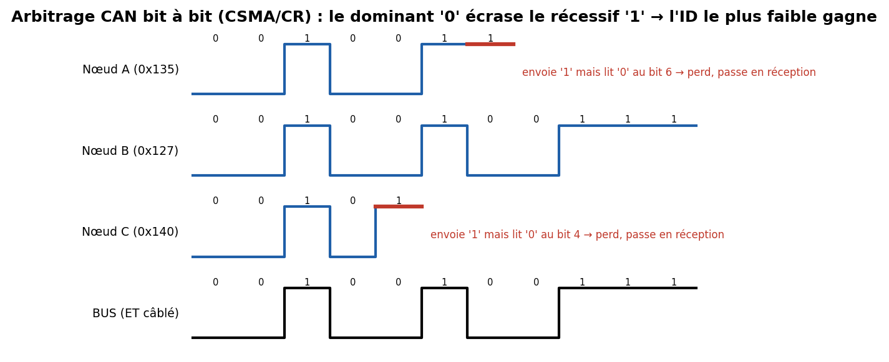

# 05 — CAN & CAN FD (Controller Area Network)

> **LE** bus de l'automobile et de l'industrie robuste. Multi-maître, différentiel, arbitrage sans collision, détection d'erreur redoutable. C'est aussi le terrain de jeu n°1 du **car hacking**. À maîtriser à fond pour ton profil.

---

## Carte d'identité

| Caractéristique | Valeur |
|---|---|
| Type | Série, **asynchrone**, half-duplex, **multi-maître** |
| Fils | **2 différentiels** : CAN_H, CAN_L (paire torsadée) |
| Arbitrage | **CSMA/CR** (Carrier Sense Multiple Access / Collision Resolution) — **non destructif** |
| Adressage | **par message (identifiant)**, PAS par nœud |
| Identifiant | **11 bits** (CAN 2.0A) ou **29 bits** (CAN 2.0B étendu) |
| Débit | jusqu'à **1 Mbit/s** (Classical CAN) ; **CAN FD** jusqu'à 5–8 Mbit/s en phase données |
| Charge utile | **0–8 octets** (Classical) ; **jusqu'à 64 octets** (CAN FD) |
| Distance | ~40 m à 1 Mbit/s, ~1000 m à 50 kbit/s |
| Détection d'erreur | **CRC-15** + ACK + bit-stuffing + form/monitoring → Hamming distance 6 |
| Normes | **ISO 11898** (-1 liaison, -2 PHY haute vitesse) ; inventé par **Bosch** (1986) |

---

## 1. Le problème que ça résout

Dans une voiture des années 80, chaque fonction avait son câblage dédié → des **kilomètres de fils**. CAN permet à **des dizaines d'ECU** de partager **une seule paire torsadée**, avec :
- **robustesse** (différentiel + détection d'erreur très forte),
- **priorité** (les messages urgents passent avant),
- **pas de collision destructive** (contrairement à Ethernet historique).

Point conceptuel clé : **CAN n'adresse pas des nœuds, il diffuse des messages**. Chaque trame porte un **identifiant** qui décrit **le contenu** (« régime moteur », « vitesse roue AVG »), pas le destinataire. Chaque ECU **filtre** les identifiants qui l'intéressent. C'est un bus **orienté message / producteur-consommateur**.

---

## 2. Couche physique différentielle



Deux fils portent des états logiques nommés **dominant** et **récessif** :
- **Récessif = '1'** : CAN_H ≈ CAN_L ≈ 2,5 V → **Vdiff ≈ 0 V**. C'est l'état au repos.
- **Dominant = '0'** : CAN_H ≈ 3,5 V, CAN_L ≈ 1,5 V → **Vdiff ≈ 2 V**.

Propriété **fondamentale** : sur le bus câblé, **dominant écrase récessif** (wired-AND électrique). Si un nœud émet dominant (0) et un autre récessif (1) **au même instant**, le bus est **dominant (0)**. Toute la magie de CAN découle de là.

**Terminaison** : 120 Ω à **chaque** extrémité de la paire (2×120 Ω = 60 Ω vus par un transceiver). Indispensable.

---

## 3. La trame de données (Classical CAN 2.0A)

De gauche à droite (voir figure §2) :

| Champ | Bits | Rôle |
|---|---|---|
| **SOF** (Start Of Frame) | 1 | bit dominant, marque le début |
| **Identifiant** | 11 | priorité + « sujet » du message |
| **RTR** | 1 | Remote Transmission Request (0 = trame de données) |
| **IDE** | 1 | 0 = ID standard 11 bits, 1 = étendu 29 bits |
| **r0** | 1 | réservé |
| **DLC** | 4 | Data Length Code (nombre d'octets, 0–8) |
| **Données** | 0–64 | la charge utile |
| **CRC** | 15 (+1 délimiteur) | contrôle d'intégrité |
| **ACK** | 1 (+1 délimiteur) | tout récepteur qui a bien reçu tire ce bit à dominant |
| **EOF** | 7 | End Of Frame (récessifs) |
| **IFS** | 3 | Inter-Frame Space |

Le champ **ID + RTR** forme le **champ d'arbitrage**.

---

## 4. L'arbitrage bit à bit — CSMA/CR (le point d'or)

Plusieurs nœuds peuvent commencer à émettre en même temps. Voici comment CAN résout la collision **sans rien détruire** :



Chaque émetteur, pendant qu'il envoie son identifiant, **écoute le bus**. Règle :
> Si j'envoie un bit **récessif (1)** mais que je **lis dominant (0)** sur le bus, c'est qu'un autre nœud plus prioritaire parle → **je me tais immédiatement** et je repasse en réception.

Comme dominant (0) gagne toujours, **l'identifiant numériquement le plus PETIT gagne l'arbitrage** (plus il a de 0 en tête, plus il est prioritaire). Le gagnant **ne s'est aperçu de rien** et sa trame n'est pas corrompue → **zéro temps perdu, zéro collision destructive**. C'est la grande élégance de CAN.

**Conséquence sécurité** : l'ID `0x000` est le plus prioritaire. Un attaquant qui **spamme l'ID 0x000** gagne toujours l'arbitrage → **déni de service (bus flooding)** trivial.

---

## 5. Gestion d'erreurs (redoutable) & bit-stuffing

CAN a **5 mécanismes** de détection d'erreur qui se cumulent :
1. **Bit monitoring** : chaque émetteur relit ce qu'il émet.
2. **Bit-stuffing** : après **5 bits identiques**, on insère 1 bit opposé (garantit des fronts pour la synchro ; toute violation = erreur détectée).
3. **CRC-15** sur la trame.
4. **Form check** : les champs à valeur fixe (délimiteurs, EOF) doivent être corrects.
5. **ACK check** : au moins un récepteur doit acquitter.

Quand un nœud détecte une erreur, il émet un **error frame** (6 bits dominants) qui **invalide la trame partout**, et l'émetteur **rejoue automatiquement** la trame. → fiabilité extrême.

**Confinement des fautes (fault confinement)** : chaque nœud tient deux compteurs (**TEC**/**REC**). Un nœud qui accumule des erreurs passe **error-passive** puis **bus-off** (il se déconnecte) → un nœud défaillant ne peut pas paralyser le bus indéfiniment.
**Attaque associée** : le **Bus-Off Attack** consiste à provoquer volontairement des erreurs sur les trames d'un ECU cible pour le forcer en **bus-off** (le faire taire) — une attaque DoS ciblée bien connue en recherche automobile.

---

## 6. CAN FD (Flexible Data-rate)

Extension (Bosch 2012, ISO 11898-1:2015) qui lève deux limites de CAN classique :
- **Débit variable** : l'arbitrage reste lent (compatibilité), mais **après l'arbitrage**, la phase de données passe à un **débit plus élevé** (2–8 Mbit/s).
- **Charge utile jusqu'à 64 octets** (au lieu de 8) → moins d'overhead, indispensable pour l'ADAS et l'*over-the-air*.
- **CRC renforcé** (17 ou 21 bits selon la taille).

**CAN XL** (2020+) va plus loin : jusqu'à **2048 octets** et ~10 Mbit/s, pour concurrencer l'Ethernet automobile bas de gamme.

---

## 7. Au-dessus de CAN : les couches applicatives

CAN brut ne transporte que 8 (ou 64) octets. Pour faire « plus », on empile :
- **ISO-TP / ISO 15765-2** : segmentation pour envoyer > 8 octets (nécessaire au diagnostic).
- **UDS (ISO 14229)** : Unified Diagnostic Services — lecture de DTC, flashage d'ECU, `SecurityAccess`… **la** cible des attaques diag.
- **OBD-II (ISO 15031 / SAE J1979)** : diagnostic embarqué réglementaire (port sous le volant). PIDs standardisés.
- **CANopen** (industrie), **J1939** (poids-lourds), **NMEA 2000** (marine) : profils métier.

---

## 8. Sécurité 🔒 (section clé pour ton profil)

CAN a été conçu en **1986 pour la sûreté (safety), pas la sécurité (security)**. Il n'a **ni authentification, ni chiffrement, ni contrôle d'accès**. Tout nœud sur le bus peut lire et écrire tout message.

**Surface d'attaque & attaques emblématiques**
- **Sniffing / reverse** : lire tout le trafic, identifier quel ID fait quoi (car les DBC constructeurs sont secrets) → outils comme `caringcaribou`, `cantools`.
- **Injection / spoofing** : envoyer une trame avec l'ID d'un ECU légitime pour **commander** un actionneur (Miller & Valasek, **Jeep Cherokee 2015** : prise de contrôle à distance via la télématique → CAN → direction/freins → **rappel de 1,4 M véhicules**).
- **Replay** : rejouer des trames capturées (ex. déverrouillage).
- **DoS / bus flooding** : spammer l'ID `0x000` pour saturer l'arbitrage.
- **Bus-Off Attack** : forcer un ECU cible en bus-off par injection d'erreurs.
- **Point d'entrée** : port **OBD-II** (accès physique), mais surtout **passerelles** télématique/infotainment/Bluetooth/Wi-Fi mal isolées (accès distant).

**Contre-mesures**
- **Segmentation & gateway** : séparer les domaines (infotainment ↔ powertrain) et **filtrer** au niveau de la passerelle.
- **IDS/IDPS embarqué** : détecter les anomalies (fréquence d'un ID, valeurs impossibles, ID absents des DBC).
- **Authentification de message** : **AUTOSAR SecOC** (Secure Onboard Communication) ajoute un **MAC** tronqué + compteur anti-rejeu (freshness) aux trames critiques.
- **UDS SecurityAccess** durci (vrais algos de challenge, pas des seeds triviales).
- **Cadre normatif** : **ISO/SAE 21434** (cybersécurité des véhicules) et **UNECE R155/R156** (obligation légale de gestion de la cybersécurité et des mises à jour).

---

## 9. Pratique — matériel & outils

| Besoin | Outil |
|---|---|
| Interface CAN abordable | adaptateur **USB↔CAN** (CANable/candleLight, Kvaser, PEAK PCAN) |
| DIY | MCU + transceiver **MCP2515+MCP2551** ou puce **MCP2518FD** (CAN FD) |
| Logiciel Linux | **SocketCAN** (`can-utils`) : `candump`, `cansend`, `cangen` |
| Reverse / attaque (audit) | **caring-caribou**, **cantools**, **SavvyCAN** (GUI) |
| Bancs | ECU d'occasion, simulateur ICSim (apprentissage sans voiture) |

```bash
# Linux SocketCAN avec un CANable en 500 kbit/s
sudo ip link set can0 type can bitrate 500000
sudo ip link set up can0

candump can0                       # écouter tout le bus
cansend can0 123#DEADBEEF          # injecter l'ID 0x123 avec 4 octets
cangen  can0 -I 000 -L 8 -g 1      # (démo DoS) spammer l'ID prioritaire 0x000
```
> ⚠️ **Uniquement** sur un banc/véhicule t'appartenant. L'injection sur un véhicule en circulation est dangereuse et illégale.

**Pour s'entraîner sans voiture** : **ICSim** (Instrument Cluster Simulator) d'OpenGarages simule un tableau de bord sur `vcan0`.

---

## 10. Sources

- **Bosch — CAN Specification 2.0** (le document historique) : <http://esd.cs.ucr.edu/webres/can20.pdf>
- **ISO 11898-1/-2** (liaison & PHY) — spec officielle (ISO, payant).
- **CSS Electronics — CAN Bus / CAN FD / OBD2 « ultimate guides »** (excellents, schémas libres) : <https://www.csselectronics.com/pages/can-bus-simple-intro-tutorial>
- **Vector — CAN E-Learning** : <https://elearning.vector.com/>
- **can-utils / SocketCAN** : <https://github.com/linux-can/can-utils>
- **caring-caribou** (audit CAN/UDS) : <https://github.com/CaringCaribou/caringcaribou>
- **ICSim** (simulateur d'entraînement) : <https://github.com/zombieCraig/ICSim>
- **Miller & Valasek — « Remote Exploitation of an Unaltered Passenger Vehicle » (2015)** : <http://illmatics.com/Remote%20Car%20Hacking.pdf>
- **ISO/SAE 21434** et **UNECE R155/R156** : cadres cybersécurité automobile.
- Livre : *The Car Hacker's Handbook*, Craig Smith (No Starch Press) — <https://nostarch.com/carhacking>
