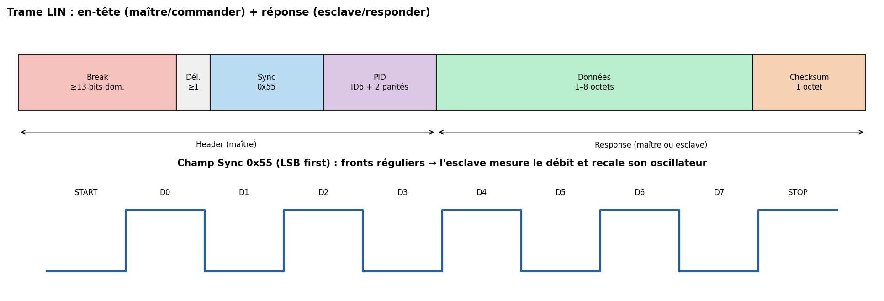

# 06 — LIN (Local Interconnect Network)

> Le « petit frère » de CAN. Un seul fil, très bas coût, pour les fonctions non critiques de la carrosserie : lève-vitres, rétros, capteurs de pluie, ventilation. Maître unique, esclaves qui ne parlent que sur invitation.

---

## Carte d'identité

| Caractéristique | Valeur |
|---|---|
| Type | Série, **asynchrone** (UART sous-jacent), **maître unique** |
| Fils | **1** (LIN, single-ended) + masse ; référencé à la batterie 12 V |
| Rôles | 1 **maître (commander)** + jusqu'à **15 esclaves (responders)** |
| Horloge | Aucune ; les esclaves **se recalent** sur le champ Sync |
| Débit | **jusqu'à 20 kbit/s** (souvent 9,6 ou 19,2 kbit/s) |
| Adressage | par **identifiant de trame** (6 bits → 64 IDs) |
| Détection d'erreur | **checksum** (classique ou « enhanced ») + parité sur le PID |
| Distance | ~40 m, ~16 nœuds |
| Normes | **LIN 1.x/2.x**, puis **ISO 17987** (2016) ; base **SAE J2602** |

---

## 1. Le problème que ça résout

CAN est **robuste mais cher** (transceiver différentiel, quartz, contrôleur). Pour un lève-vitre ou un capteur de luminosité, c'est **disproportionné**. LIN vise le **coût minimal** :
- **un seul fil** (pas de paire différentielle),
- **pas de quartz** dans les esclaves (ils se synchronisent sur le maître → oscillateur RC suffisant),
- implémentable sur **l'UART** que tout MCU 8 bits possède déjà.

LIN est **complémentaire** de CAN : un ECU « maître » de carrosserie porte souvent un **sous-réseau LIN** d'un côté et se raccorde au **CAN** de l'autre (rôle de passerelle).

---

## 2. Couche physique

- **Single-ended** sur **un fil**, référencé à la **masse véhicule**, niveaux basés sur la **tension batterie (~12 V)** : récessif ≈ Vbat, dominant ≈ 0 V (comme un open-collector tiré vers la masse, avec pull-up ~1 kΩ côté maître, 30 kΩ côté esclaves).
- Débit plafonné à **20 kbit/s** notamment pour limiter les **émissions électromagnétiques (EMC)** sur ce fil non blindé.
- Transceiver LIN dédié (ex. TJA1021) qui gère les niveaux 12 V et la protection.

---

## 3. La trame LIN

Une trame se compose d'un **en-tête (header)**, **toujours** émis par le **maître**, suivi d'une **réponse (response)** émise soit par le maître, soit par un esclave désigné.

**Header (maître) :**
1. **Break** : ≥ 13 bits **dominants** (0) — une « anomalie » volontaire au regard de l'UART, qui signale sans ambiguïté un début de trame.
2. **Sync** : l'octet **0x55** (`0101 0101`). Ses fronts réguliers permettent à chaque esclave de **mesurer précisément la durée d'un bit** et donc de **recaler son horloge RC** sur le débit du maître. C'est l'astuce qui autorise les esclaves sans quartz.
3. **PID (Protected Identifier)** : 6 bits d'ID + 2 bits de **parité**. L'ID désigne **le contenu** de la trame (comme CAN) ; il détermine **quel esclave** doit répondre.

**Response (maître ou esclave) :**
4. **Données** : 1 à 8 octets.
5. **Checksum** : 1 octet. *Classic* (sur les données seules, LIN 1.x) ou *Enhanced* (inclut le PID, LIN 2.x).

---

## 4. Ordonnancement déterministe (schedule table)

Le maître suit une **table d'ordonnancement (schedule table)** : il envoie les headers **à intervalles fixes**, dans un ordre défini à la conception. Comme **seul le maître initie** et qu'**un seul esclave répond** par ID, il **n'y a jamais de collision** → comportement **déterministe** et simple, au prix du débit.

Types de trames : *unconditional* (planifiée), *event-triggered* (un esclave répond seulement s'il a du nouveau), *sporadic*, *diagnostic* (IDs 0x3C/0x3D pour le diag et la configuration).

---

## 5. Aspects poussés

- **Node capability / LDF & NCF** : la config d'un réseau LIN est décrite par un fichier **LDF (LIN Description File)** ; les fichiers **NCF** décrivent chaque nœud. Outils : LIN de Vector (LINspector), etc.
- **Diagnostic & auto-adressage** : LIN 2.x normalise le diagnostic transporté (IDs 0x3C/0x3D) et l'attribution automatique d'adresses (utile pour des chaînes d'actionneurs identiques).
- **Réveil / sommeil (wake-up / sleep)** : commandes de mise en veille pour économiser la batterie ; réveil par activité sur le bus.
- **Robustesse** : parité sur le PID + checksum ; pas de mécanisme de retransmission automatique aussi élaboré que CAN.

---

## 6. Sécurité 🔒

LIN est encore **plus simple et moins protégé** que CAN : **aucune** authentification ni chiffrement, débit faible, **un seul fil accessible**.

**Surface d'attaque**
- **Sniffing trivial** : un fil, un transceiver LIN (ou même un UART bien réglé), et on lit tout.
- **Spoofing d'esclave** : usurper la réponse d'un esclave (fausse valeur de capteur de pluie/luminosité, etc.).
- **Usurpation du maître** : plus intrusif, injecter des headers pour piloter des actionneurs.
- **Pivot** : un sous-réseau LIN compromis peut servir de **point d'appui** vers l'ECU passerelle et donc, potentiellement, vers le **CAN** (si la passerelle est mal cloisonnée).

**Contre-mesures**
- **Cloisonner** LIN des bus critiques via la passerelle (LIN ne pilote que des fonctions **non critiques** par conception, ce qui limite l'impact direct).
- **Contrôles de plausibilité** côté maître (valeurs incohérentes ignorées).
- **Sécurité applicative** (compteur/MAC) sur les commandes sensibles — rare car LIN vise le bas coût, mais possible.
- **Accès physique** : la vraie barrière reste l'accès au faisceau ; le durcissement se joue surtout au niveau de l'architecture (isolation des domaines).

---

## 7. Pratique — matériel & outils

| Besoin | Outil |
|---|---|
| Sniffer/injecter | Interface **LIN↔USB** (Vector VN1630, PEAK PLIN, ou DIY MCU + transceiver **TJA1021/MCP2003**) |
| Voir les trames | Analyseur logique + décodeur LIN (sigrok/PulseView) |
| Décoder en Python | `python-lin` / scripts UART (le LIN est de l'UART + break) |
| Bancs | modules de carrosserie d'occasion |

> Astuce : comme LIN repose sur l'UART, on peut souvent le **capturer avec un simple adaptateur série** réglé au bon débit, en repérant le *break* et le Sync 0x55.

---

## 8. Sources

- **NI — Introduction au protocole de bus LIN** (FR) : <https://www.ni.com/fr/shop/seamlessly-connect-to-third-party-devices-and-supervisory-system/introduction-to-the-local-interconnect-network-lin-bus.html>
- **CSS Electronics — LIN Bus Explained** : <https://www.csselectronics.com/pages/lin-bus-protocol-intro-basics>
- **AutoPi — LIN Bus Explained (Master/Slave, wiring, erreurs)** : <https://www.autopi.io/blog/lin-bus-protocol-explained/>
- **ISO 17987** (série) — spec officielle LIN.
- **NXP — TJA1021 / TJA1027 LIN transceiver datasheets** : <https://www.nxp.com/products/interfaces/lin-transceivers>
- **Vector — LIN E-Learning / outils** : <https://elearning.vector.com/>
- **sigrok — décodeur LIN** : <https://sigrok.org/wiki/Protocol_decoder:Lin>
