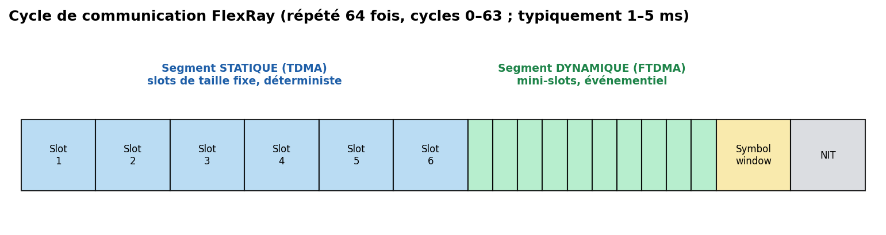

# 07 — FlexRay

> Le bus **déterministe** et **tolérant aux fautes** de l'automobile critique : suspension active, freinage et direction *x-by-wire*. Là où CAN dit « le plus prioritaire passe quand il peut », FlexRay dit « **chaque message a son créneau, à la microseconde près** ».

---

## Carte d'identité

| Caractéristique | Valeur |
|---|---|
| Type | Série, **synchrone (temps global)**, **déterministe** |
| Fils | **1 ou 2 canaux** différentiels (BP/BM), redondance possible |
| Accès au médium | **TDMA** (statique) + **FTDMA** (dynamique) |
| Débit | **10 Mbit/s** par canal (jusqu'à 20 Mbit/s avec 2 canaux) |
| Charge utile | **jusqu'à 254 octets** par trame |
| Topologie | bus, **étoile (active)**, hybride |
| Nœuds | jusqu'à ~64 par cluster |
| Tolérance aux fautes | **double canal**, bus guardian, synchro d'horloge distribuée |
| Normes | **ISO 17458** ; consortium FlexRay (BMW, Bosch, Daimler, GM…) 2000-2009 |

---

## 1. Le problème que ça résout

Pour la **sûreté de fonctionnement** (freiner, diriger), il faut des garanties que CAN ne donne pas :
- **Déterminisme dur** : un message critique doit passer **à un instant garanti**, pas « dès que le bus est libre ». Sous forte charge, la latence de CAN devient **non bornée** pour les messages peu prioritaires.
- **Débit** plus élevé (10 Mbit/s vs 1 Mbit/s).
- **Tolérance aux fautes** : redondance de câblage, empêchement qu'un nœud « bavard » (*babbling idiot*) monopolise le bus.

FlexRay répond par un **accès au médium par tranches de temps synchronisées** — pensé pour le ***x-by-wire***.

---

## 2. Couche physique

- **Différentiel** (BP = Bus Plus, BM = Bus Minus), états **idle / Data_1 / Data_0**, robustesse type CAN mais plus rapide.
- **1 ou 2 canaux** (A et B) : soit **redondance** (même donnée sur les deux → tolérance à la coupure d'un canal), soit **doublement du débit** (données différentes).
- Topologies : **bus passif**, **étoile active** (un coupleur régénère le signal → distances/robustesse), ou **hybride**. L'étoile active est fréquente pour maîtriser l'intégrité du signal à 10 Mbit/s.
- Codage **8N1** par octet avec des séquences de synchro (Byte Start Sequence) pour la récupération d'horloge.

---

## 3. Le cycle de communication (le cœur de FlexRay)

Tout tourne autour d'un **cycle** répété, découpé en segments. Le cycle se répète et son **numéro** (0 à 63) permet même de planifier des messages « un cycle sur deux ».

Un cycle contient jusqu'à 4 parties :

1. **Segment statique (TDMA)** — le cœur du déterminisme.
   Découpé en **slots de taille fixe**, **pré-attribués** à un nœud précis. Le nœud propriétaire du slot 5 émet **toujours** dans le slot 5, **que le bus soit chargé ou non**. → **latence garantie et bornée**. C'est là que passent les messages critiques.

2. **Segment dynamique (FTDMA)** — souplesse événementielle.
   Découpé en **mini-slots**. Un nœud qui a quelque chose à dire « consomme » son mini-slot ; s'il n'a rien, le mini-slot passe vite au suivant. Priorité par position. → efficace pour le trafic sporadique, sans casser le déterminisme du segment statique.

3. **Symbol window** : symboles spéciaux (réveil, collision d'intégration au démarrage).

4. **NIT (Network Idle Time)** : temps mort pendant lequel les nœuds **corrigent leur horloge** pour rester synchrones.

---

## 4. Synchronisation d'horloge distribuée (indispensable au TDMA)

Le TDMA n'a de sens que si **tous les nœuds partagent le même temps**. FlexRay n'a **pas d'horloge maître unique** (ce serait un point de défaillance) : il utilise une **synchro distribuée**.
- Des nœuds désignés (**sync nodes**) émettent des **sync frames** dans le segment statique.
- Chaque nœud mesure l'écart entre l'instant théorique et l'instant réel de ces trames, et applique une **correction d'offset (phase)** et de **rate (fréquence)** — l'algorithme (fault-tolerant midpoint) écarte les valeurs extrêmes pour résister à un nœud défaillant.
- Vocabulaire : **microtick** (tic local de l'oscillateur) → **macrotick** (unité de temps globale, ~1 µs) → **slot** → **cycle**. Précision typique : quelques centaines de ns.

---

## 5. Tolérance aux fautes

- **Bus guardian** : composant qui **surveille** qu'un nœud n'émet **que dans ses slots** autorisés → neutralise le *babbling idiot* (nœud qui émettrait n'importe quand).
- **Double canal** : un câble sectionné n'arrête pas la communication.
- **Startup/wakeup** robuste : procédure coordonnée pour démarrer le temps global (nœuds *coldstart*).
- **POC (Protocol Operation Control)** : machine d'état gérant les modes (config, wakeup, startup, normal active/passive, halt).

---

## 6. Sécurité 🔒

FlexRay est moins « populaire » que CAN chez les attaquants (moins répandu, plus complexe, matériel plus cher), mais les principes de menace sont similaires — **pas d'authentification ni de chiffrement natifs**.

**Surface d'attaque**
- **Sniffing** : nécessite du matériel FlexRay (plus rare/cher qu'un adaptateur CAN), mais tout à fait faisable.
- **Injection dans le segment dynamique** : plus accessible que le statique (protégé par le bus guardian et l'attribution stricte des slots).
- **Perturbation de la synchro** : viser les *sync frames* pour dégrader la synchro d'horloge = attaque spécifique au déterminisme.
- **Accès** : comme pour CAN, le vrai risque vient des **passerelles** (télématique/infotainment) plus que de l'accès physique direct.

**Contre-mesures**
- **Bus guardian** et attribution stricte des slots limitent nativement l'injection arbitraire dans le segment statique (bénéfice « sûreté » qui aide aussi la sécurité).
- **Isolation par gateway** et **IDS** (mêmes principes que CAN).
- **SecOC/AUTOSAR** applicable aux messages critiques.
- Cadre **ISO/SAE 21434** identique à tout l'automobile.

---

## 7. Pratique — matériel & outils

| Besoin | Outil |
|---|---|
| Analyse/injection | **Vector** (VN7600, CANoe.FlexRay), **PEAK FlexRay**, oscilloscope FlexRay |
| Contrôleurs | **NXP MFR4310**, MCU auto avec IP FlexRay |
| Apprentissage | **Vector FlexRay E-Learning** (gratuit, 29 unités) |

> Le matériel FlexRay reste **plus onéreux** que le CAN grand public : l'entrée se fait souvent en milieu pro/labo. Pour un étudiant, l'important est de **maîtriser le modèle temporel** (cycle / segments / slots / synchro), qui est le vrai apport conceptuel du protocole.

---

## 8. Sources

- **Vector — FlexRay E-Learning** (29 unités, gratuit) : <https://elearning.vector.com/course/view.php?id=22>
- **ISO 17458** (parties 1 à 5) — spec officielle FlexRay.
- **NXP — FlexRay resources & MFR4310** : <https://www.nxp.com/products/interfaces/flexray>
- **CSS Electronics — FlexRay intro** : <https://www.csselectronics.com/pages/flexray-bus>
- **Rausch, M. — *FlexRay: Grundlagen, Funktionsweise, Anwendung*** (ouvrage de référence, en allemand).
- **igi-global — FlexRay Electrical Physical Layer** (chapitre technique) : <https://www.igi-global.com/chapter/flexray-electrical-physical-layer/74485>
