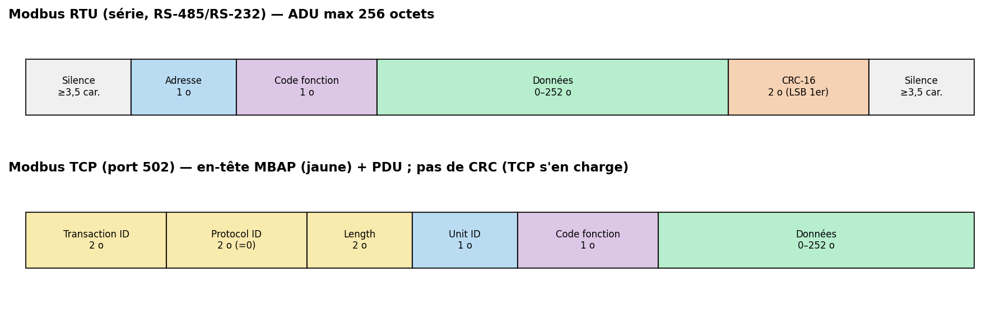
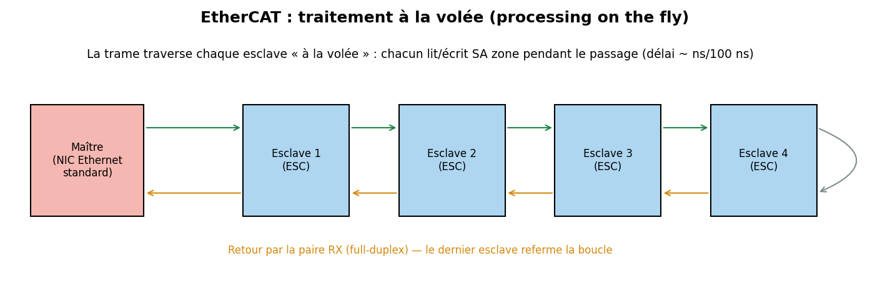

# 08 — Bus de terrain industriels : RS-485, Modbus, PROFIBUS, PROFINET, EtherCAT

> Le monde de l'**automate (PLC)**, de l'usine et du SCADA. On part de la couche électrique **RS-485**, on monte au protocole **Modbus**, puis aux bus de terrain temps réel (**PROFIBUS/PROFINET**, **EtherCAT**). Enjeu cybersécurité majeur : **la sécurité des systèmes industriels (ICS/OT)**.

---

## Vue d'ensemble

| Techno | Couche | Débit | Temps réel | Sécurité native |
|---|---|---|---|---|
| **RS-485** | physique (électrique) | jusqu'à ~10–35 Mbit/s | — | aucune |
| **Modbus RTU** | applicatif sur RS-485 | ≤ ~115 kbit/s | non | **aucune** |
| **Modbus TCP** | applicatif sur Ethernet | Ethernet | non | **aucune** |
| **PROFIBUS DP** | terrain sur RS-485 | jusqu'à 12 Mbit/s | oui (cyclique) | aucune |
| **PROFINET** | terrain sur Ethernet | 100 Mbit/s+ | oui (RT/IRT) | limitée |
| **EtherCAT** | terrain sur Ethernet | 100 Mbit/s | **oui (µs)** | aucune |

---

## 1. RS-485 : la couche électrique reine de l'industrie

**RS-485** (TIA/EIA-485) est une **norme électrique** (pas un protocole), pensée pour la **longue distance en milieu bruité**.


- **Différentiel** (paire A/B) → immunité au bruit de mode commun (voir fiche 00 §5).
- **Multipoint** : jusqu'à **32 charges unitaires** (souvent étendu à 128/256 avec des transceivers à faible charge) sur **une paire torsadée**.
- **Longue distance** : jusqu'à **~1200 m** à bas débit ; produit débit×distance quasi constant.
- **Half-duplex** (2 fils) ou **full-duplex** (4 fils). En 2 fils, il faut gérer le sens (**DE/RE** du transceiver, souvent piloté par le RTS ou un GPIO).
- **Terminaison 120 Ω** aux deux extrémités + polarisation (*fail-safe biasing*) pour définir l'état repos.

RS-485 **transporte** des protocoles : Modbus RTU, PROFIBUS, DMX512 (éclairage scénique), et d'innombrables protocoles propriétaires.

> **RS-422** = variante point-à-multipoint full-duplex (1 émetteur, N récepteurs). **RS-232** = single-ended courte distance (voir fiche UART).

---

## 2. Modbus : le protocole industriel universel

Créé par **Modicon (1979)**, Modbus est **simplissime** et donc **omniprésent** : automates, variateurs, capteurs, compteurs d'énergie, onduleurs, GTB.

### 2.1 Modèle de données
Modbus expose 4 espaces d'adressage :
| Table | Accès | Taille | Usage |
|---|---|---|---|
| **Coils** | lecture/écriture | 1 bit | sorties TOR |
| **Discrete inputs** | lecture | 1 bit | entrées TOR |
| **Input registers** | lecture | 16 bits | mesures |
| **Holding registers** | lecture/écriture | 16 bits | consignes/paramètres |

### 2.2 Codes fonction courants
`0x01` Read Coils · `0x02` Read Discrete Inputs · `0x03` Read Holding Registers · `0x04` Read Input Registers · `0x05` Write Single Coil · `0x06` Write Single Register · `0x0F` Write Multiple Coils · `0x10` Write Multiple Registers.

### 2.3 RTU vs TCP


- **Modbus RTU** (série, RS-485) : trame = `Adresse(1) + Fonction(1) + Données + CRC-16(2)`, encadrée par des **silences ≥ 3,5 caractères**. Maître unique, esclaves adressés 1–247.
- **Modbus ASCII** : variante lisible (caractères hex), délimitée par `:` et CRLF, checksum LRC. Rare aujourd'hui.
- **Modbus TCP** (port **502**) : on retire le CRC (TCP gère la fiabilité) et on ajoute un en-tête **MBAP** (Transaction ID, Protocol ID=0, Length, Unit ID). Multi-maître via connexions TCP multiples.

---

## 3. PROFIBUS & PROFINET

- **PROFIBUS DP** (Decentralized Peripherals) : bus de terrain sur **RS-485**, **maître-esclave cyclique déterministe**, jusqu'à **12 Mbit/s**, très répandu en automatisation manufacturière (Siemens). **PROFIBUS PA** en dérive pour le process (sûreté intrinsèque, alim sur le bus).
- **PROFINET** : la version **sur Ethernet**. Trois classes : **NRT** (non temps réel, TCP/IP), **RT** (Real-Time, trames Ethernet prioritaires contournant IP), **IRT** (Isochronous, matériel dédié, jitter < µs pour le motion control). Domine aujourd'hui les nouvelles installations.

---

## 4. EtherCAT : le temps réel « à la volée »

**EtherCAT** (Beckhoff, IEC 61158) est un bus de terrain sur **Ethernet standard côté maître** avec une astuce de génie côté esclaves :



- Le **maître** (une simple carte Ethernet) envoie **une seule trame** qui **parcourt tous les esclaves en guirlande**.
- Chaque esclave, grâce à un ASIC dédié (**ESC**, EtherCAT Slave Controller), **lit et écrit sa portion de la trame pendant qu'elle le traverse** — **sans la stocker** (*processing on the fly*, délai de quelques dizaines/centaines de ns).
- La trame revient au maître par le dernier esclave (anneau logique en full-duplex).

Résultat : **des centaines d'axes rafraîchis en dizaines de µs**, avec du matériel Ethernet ordinaire côté maître. C'est **le** bus du *motion control* moderne. **Distributed Clocks** offre une synchro < 1 µs entre esclaves.

---

## 5. Aspects poussés

- **Déterminisme** : PROFIBUS (jeton/cyclique), PROFINET IRT et EtherCAT (créneaux/hardware) garantissent des temps de cycle bornés, indispensables au contrôle de mouvement — contrairement à Modbus (requête/réponse best-effort).
- **TSN (Time-Sensitive Networking)** : ensemble de standards IEEE 802.1 qui apporte le **déterminisme sur Ethernet standard** (mise en file par le temps, synchro 802.1AS). C'est la convergence vers laquelle vont PROFINET, l'automobile et l'industrie.
- **Passerelles** : les usines réelles mélangent tout ça ; des passerelles Modbus↔PROFINET↔OPC-UA relient les couches terrain et supervision.
- **OPC-UA** : au-dessus, la couche d'interopérabilité/sécurité (authentification, chiffrement) recommandée pour l'IIoT.

---

## 6. Sécurité 🔒 (ICS/OT — enjeu majeur)

Ces protocoles ont été conçus pour des **réseaux physiquement isolés et « de confiance »**. Avec la convergence IT/OT et l'Industrie 4.0, ils se retrouvent **exposés**, alors qu'ils n'ont **aucune sécurité native**.

**Surface d'attaque (Modbus en tête)**
- **Aucune authentification, aucun chiffrement** : quiconque atteint le réseau peut **lire et écrire** coils/registres → **commander des actionneurs** (ouvrir une vanne, changer une consigne), **falsifier des mesures**.
- **Modbus TCP exposé sur Internet** : des milliers d'équipements sont trouvables via **Shodan** (port 502 ouvert).
- **Pas de contrôle d'intégrité crypto** : le CRC/checksum protège du bruit, pas d'un attaquant.
- **PROFINET/EtherCAT** : injection/altération de trames RT sur le segment ; déni de service temps réel (casser le cycle = arrêter la machine).
- **Contexte réel** : **Stuxnet** (2010) a visé des automates Siemens S7 (PROFIBUS/PROFINET) pour saboter des centrifugeuses ; **TRITON/TRISIS** a visé des systèmes instrumentés de sécurité (SIS). Ce sont les références historiques de l'attaque ICS.

**Contre-mesures (défense en profondeur ICS)**
- **Segmentation réseau & zones/conduits** (modèle **IEC 62443**, purdue model) : séparer IT / OT / cellules, DMZ industrielle.
- **Pare-feux industriels / diodes de données** ; pas de Modbus TCP directement sur Internet.
- **IDS OT** (ex. règles Suricata/Snort spécifiques, solutions Nozomi/Claroty) qui comprennent Modbus/PROFINET.
- **Modbus Security (Modbus/TCP Security)** : variante sur **TLS (port 802)** avec authentification par certificats — mais peu déployée.
- **OPC-UA** pour les échanges nécessitant authentification/chiffrement.
- **Durcissement des automates** (désactiver services inutiles, MAJ firmware, contrôle d'accès physique).

---

## 7. Pratique — matériel & outils

| Besoin | Outil |
|---|---|
| Adaptateur RS-485 | USB↔RS-485 (FTDI, MAX485/MAX3485) |
| Maître/esclave Modbus | `mbpoll`, **QModMaster**, `pymodbus` (Python), `modbus-cli` |
| Simuler un esclave | **diagslave**, `pymodbus.server` |
| Audit / pentest ICS | **Metasploit** modules Modbus, **plcscan**, **Nmap** scripts `modbus-discover`, Scapy (contrib Modbus) |
| Découverte exposition | Shodan (recherche `port:502`) |

```python
# Lire 10 holding registers d'un esclave Modbus TCP avec pymodbus
from pymodbus.client import ModbusTcpClient
c = ModbusTcpClient("192.168.1.10", port=502)
c.connect()
rr = c.read_holding_registers(address=0, count=10, slave=1)
print(rr.registers)
c.close()
```
```bash
# mbpoll : lire 5 registres (fonction 3) de l'esclave 1 en TCP
mbpoll -m tcp -a 1 -r 1 -c 5 -t 4 192.168.1.10
```
> ⚠️ Sur un **banc de test** uniquement. Écrire sur un automate en production peut avoir des conséquences physiques graves.

---

## 8. Sources

- **Modbus.org — spécifications officielles** (Application Protocol, Serial Line, Messaging TCP) : <https://www.modbus.org/specs.php>
- **PI (PROFIBUS & PROFINET International)** : <https://www.profibus.com/>
- **EtherCAT Technology Group** : <https://www.ethercat.org/>
- **TI — RS-485 design guides (SLLA272, etc.)** : <https://www.ti.com/interface/rs-485/overview.html>
- **IEC 62443** (cybersécurité des systèmes d'automatisation industrielle) — cadre normatif OT.
- **pymodbus** : <https://github.com/pymodbus-dev/pymodbus>
- **CISA ICS / ICS-CERT** (alertes, bonnes pratiques ICS) : <https://www.cisa.gov/topics/industrial-control-systems>
- Analyses **Stuxnet** (Symantec *W32.Stuxnet Dossier*) et **TRITON** (FireEye/Mandiant) — études de cas ICS.
