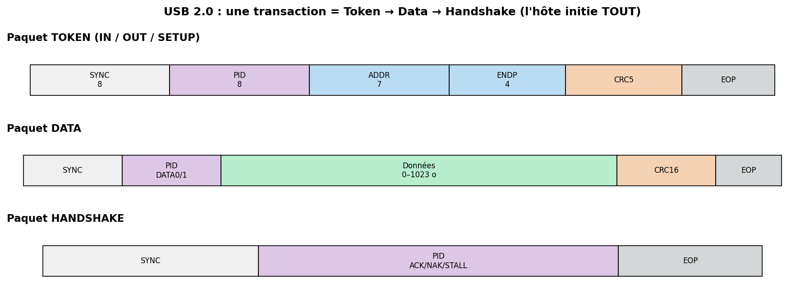

# 09 — USB (Universal Serial Bus)

> Le bus périphérique universel : hot-plug, alimentation, énumération automatique, du clavier au SSD NVMe. Côté embarqué, c'est aussi une **énorme surface d'attaque** (BadUSB, DMA via USB4/Thunderbolt).

---

## Carte d'identité

| Caractéristique | Valeur |
|---|---|
| Type | Série, **différentiel**, **maître unique (host-centric)** |
| Fils (USB 2.0) | **4** : VBUS (5 V), D+, D−, GND |
| Topologie | **arbre** (hôte → hubs → périphériques), 127 adresses max |
| Débits | Low 1,5 · Full 12 · High 480 Mbit/s (2.0) ; Super 5/10/20 Gbit/s (3.x) ; 40 Gbit/s (USB4) |
| Adressage | attribué **dynamiquement** par l'hôte à l'énumération (1–127) |
| Codage | **NRZI + bit-stuffing** (2.0) ; 8b/10b puis 128b/132b (3.x) |
| Détection d'erreur | **CRC-5** (tokens) + **CRC-16** (data) + handshakes |
| Organisme | **USB-IF** |

---

## 1. Le problème que ça résout

Avant l'USB : une jungle de ports (PS/2, série, parallèle, ADB…), pas de hot-plug, config manuelle (IRQ, DMA). USB unifie tout : **un connecteur**, **branchement à chaud**, **découverte et configuration automatiques**, et **alimentation** intégrée. Le prix : une architecture **hôte-centrique** relativement complexe.

Principe directeur : **l'hôte contrôle TOUT**. Un périphérique ne parle **jamais** de sa propre initiative ; il attend d'être **interrogé (polled)** par l'hôte. Cela simplifie les périphériques (pas d'arbitrage) mais concentre l'intelligence côté hôte.

---

## 2. Couche physique

- **USB 2.0** : paire différentielle **D+/D−** (half-duplex), codage **NRZI** avec bit-stuffing (1 bit inséré après 6 uns).
- **Détection de vitesse** : des résistances de pull-up sur D+ (Full/High speed) ou D− (Low speed) indiquent à l'hôte la vitesse du périphérique dès le branchement.
- **USB 3.x** : ajoute **des paires dédiées** (SuperSpeed) full-duplex, séparées des D+/D− → un câble 3.0 a 2 paires supplémentaires.
- **USB-C** : c'est un **connecteur réversible**, pas un protocole. Il transporte USB 2.0/3.x, **USB-PD** (Power Delivery jusqu'à 240 W), et en *Alternate Mode* du **DisplayPort/Thunderbolt/PCIe**.

---

## 3. La transaction : Token → Data → Handshake



Toute communication USB 2.0 est une suite de **transactions**, chacune composée de **paquets** :

1. **Token packet** (émis par l'hôte) : type (IN/OUT/SETUP) + adresse du périphérique (7 bits) + endpoint (4 bits) + CRC-5. → « périphérique 3, endpoint 1, prépare-toi à envoyer/recevoir ».
2. **Data packet** : DATA0/DATA1 (bascule pour la détection de perte) + 0–1024 octets + CRC-16.
3. **Handshake packet** : **ACK** (ok), **NAK** (pas prêt, réessaie), **STALL** (erreur/endpoint bloqué).

**Endpoints & types de transfert** :
- **Control** (EP0) : configuration, obligatoire.
- **Bulk** : gros volumes fiables sans garantie de délai (clé USB, imprimante).
- **Interrupt** : petits transferts périodiques à latence bornée (clavier, souris).
- **Isochronous** : débit garanti **sans retransmission** (audio, webcam) — on préfère perdre un échantillon que d'attendre.

---

## 4. L'énumération (LE mécanisme central, et clé de BadUSB)

Quand on branche un périphérique, l'hôte lance l'**énumération** :
1. Détection électrique (pull-up) + **reset** du bus.
2. L'hôte lit le **Device Descriptor** à l'adresse 0.
3. L'hôte **attribue une adresse** (1–127).
4. L'hôte lit **tous les descripteurs** : Device, Configuration, Interface, Endpoint, String, HID report…
5. Selon **VID/PID** (Vendor/Product ID) et **classe**, l'OS charge le **driver** correspondant.
6. Le périphérique est configuré et opérationnel.

**Classes USB standard** : HID (clavier/souris), Mass Storage, CDC (série/réseau), Audio, Video, Hub… Un périphérique **annonce sa classe** dans ses descripteurs. **C'est exactement là que se joue BadUSB** : rien n'empêche une clé de **prétendre** être un clavier.

---

## 5. Aspects poussés

- **USB OTG (On-The-Go)** : permet à un appareil embarqué (téléphone, MCU) d'être **tantôt hôte, tantôt périphérique** (négociation HNP/SRP).
- **Composite devices** : un seul appareil expose **plusieurs interfaces** (ex. clavier + stockage + série).
- **USB-PD** : négociation de tension/courant par messages sur le CC ; surface d'attaque en soi (firmware de contrôleurs PD).
- **Piles embarquées** : côté MCU, on utilise TinyUSB, la pile USB de STM32Cube, LUFA (AVR)… pour implémenter un périphérique (ou un hôte) USB.

---

## 6. Sécurité 🔒 (surface d'attaque majeure)

L'USB viole un principe de sécurité : **on fait confiance à ce qu'on branche**. Or un périphérique peut **mentir sur ce qu'il est**.

**Attaques emblématiques**
- **BadUSB** (Nohl & Lell, SRLabs, 2014) : reprogrammer le **firmware du contrôleur** d'une clé pour qu'elle **s'énumère comme un clavier (HID)** et **tape des commandes** à la vitesse machine dès le branchement. Indétectable par un antivirus (ce n'est pas un fichier, c'est un « clavier »).
- **Rubber Ducky / injection HID** : périphériques dédiés qui rejouent des frappes (scripts d'exfiltration, ouverture de reverse shell).
- **Juice jacking** : bornes de charge malveillantes qui tentent une connexion data.
- **DMA attacks** : via **Thunderbolt/USB4** (qui expose **PCIe**), un périphérique peut accéder **directement à la RAM** sans passer par le CPU → **lecture de secrets, contournement du verrouillage** (attaques **Thunderclap** 2019, **PCILeech**). Voir aussi fiche 10 (PCIe).
- **Attaques électriques** (« USB Killer ») : injection de haute tension pour détruire le port.
- **Exploits de piles USB** : un descripteur malformé peut planter/exploiter un driver hôte (fuzzing USB, **Facedancer/umap2**).

**Contre-mesures**
- **USB device authorization** (Linux `authorized`, **USBGuard** : politique par VID/PID/classe) → n'autoriser que les périphériques connus.
- **Blocage HID automatique** / demandes de confirmation avant d'accepter un nouveau clavier.
- **IOMMU / VT-d activé** contre les attaques DMA ; **Kernel DMA Protection** (Windows), **Thunderbolt security levels**.
- **Data blockers** (« USB condom ») pour la charge ; ne pas brancher n'importe quoi.
- **Ports verrouillés / désactivés** en environnement sensible ; **allow-list** matérielle.
- **Secure boot / firmware signé** sur les contrôleurs pour empêcher le reflashing BadUSB.

---

## 7. Pratique — matériel & outils

| Besoin | Outil |
|---|---|
| Lister/inspecter | `lsusb -v`, `usbview`, `dmesg` (voir l'énumération) |
| Capturer le trafic | **Wireshark + usbmon** (Linux), **USBPcap** (Windows) |
| Émuler/fuzz un device | **Facedancer**, **umap2**, GreatFET One |
| BadUSB / HID (recherche) | Digispire/DigiSpark, Rubber Ducky, Flipper Zero (BadUSB) |
| Analyseur protocole | Beagle USB (Total Phase), analyseurs logiques rapides |

```bash
lsusb                       # liste des périphériques (VID:PID)
lsusb -v -d 1234:5678       # descripteurs détaillés d'un device
sudo modprobe usbmon        # activer la capture USB
# puis dans Wireshark : interface usbmonX
```
Exemple de politique **USBGuard** (n'autoriser qu'un device précis) :
```bash
usbguard generate-policy > /etc/usbguard/rules.conf   # apprend l'existant
usbguard list-devices                                  # état des périphériques
```

---

## 8. Sources

- **USB-IF — spécifications officielles** (USB 2.0, 3.2, USB4, PD) : <https://www.usb.org/documents>
- **Beyond Logic — USB in a NutShell** (le tutoriel de référence, gratuit) : <https://www.beyondlogic.org/usbnutshell/usb1.shtml>
- **SRLabs — BadUSB (Nohl & Lell, Black Hat 2014)** : <https://www.srlabs.de/bites/usb-peripherals-turn>
- **Thunderclap (NDSS 2019, DMA attacks)** : <http://thunderclap.io/>
- **USBGuard** : <https://usbguard.github.io/>
- **Facedancer** (émulation/fuzzing USB) : <https://github.com/greatscottgadgets/facedancer>
- **TinyUSB** (pile USB embarquée) : <https://github.com/hathach/tinyusb>
- **Wireshark USB capture** : <https://wiki.wireshark.org/CaptureSetup/USB>
