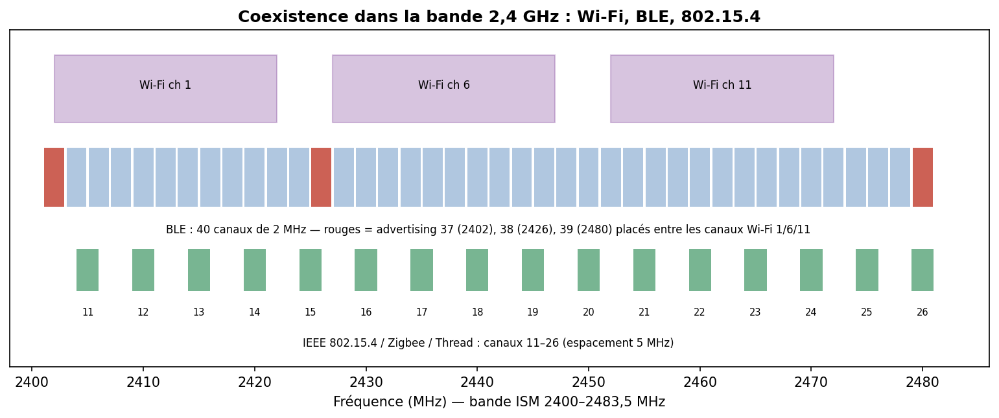
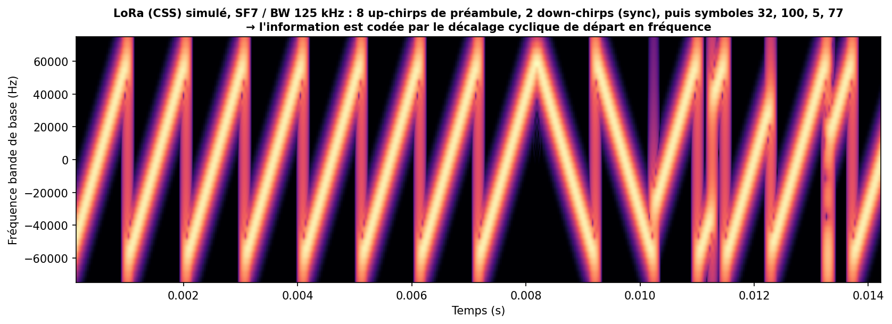

# 11 — Sans fil & IoT : BLE, Zigbee, LoRa/LoRaWAN, Wi-Fi, NB-IoT

> Quand le fil disparaît. Ici la **portée**, la **consommation** et la **sécurité radio** deviennent les axes centraux. On couvre le courte-portée (BLE, Zigbee, Wi-Fi) et le longue-portée basse conso (LoRaWAN, NB-IoT).

---

## Vue d'ensemble


| Techno | Bande | Portée | Débit | Conso | Topologie |
|---|---|---|---|---|---|
| **BLE** | 2,4 GHz ISM | 10–100 m | 0,125–2 Mbit/s | très basse | étoile / mesh |
| **Zigbee** (802.15.4) | 2,4 GHz (868/915) | 10–100 m | 250 kbit/s | basse | **mesh** |
| **Wi-Fi** | 2,4/5/6 GHz | 10–150 m | Mbit→Gbit/s | élevée | étoile (AP) |
| **LoRaWAN** | sub-GHz ISM (868 EU) | 2–15 km | 0,3–50 kbit/s | ultra-basse | étoile-d'étoiles |
| **NB-IoT** | licencié (LTE) | 1–15 km | ~30–250 kbit/s | basse | cellulaire |

La bande **2,4 GHz** est un champ de bataille partagé :



---

## A. BLE (Bluetooth Low Energy)

**Principe** : conçu pour des objets sur pile (bracelets, capteurs, balises). **40 canaux de 2 MHz** ; 3 canaux d'**advertising** (37/38/39) placés hors des canaux Wi-Fi principaux ; **saut de fréquence adaptatif (AFH)** sur les canaux de données pour éviter les interférences. Rôles : *advertiser/scanner*, puis *central/peripheral*. **GATT/ATT** structure les données en *services* et *characteristics*. BLE 5 ajoute *Long Range* (codé), *2M PHY*, et le **mesh**.

**Sécurité 🔒**
- **Appairage (pairing)** : *Just Works* (aucune protection MITM), *Passkey*, *Numeric Comparison*, *OOB*. **LE Secure Connections** (BLE 4.2+) utilise **ECDH** — bien plus sûr que le *legacy pairing* (clés facilement cassables).
- Attaques : **sniffing** (Ubertooth, nRF52 + Wireshark), **spoofing** de périphériques/balises, **rejeu**, **KNOB** (forcer une entropie de clé faible), **BLESA** (attaques à la reconnexion), famille **SweynTooth** (plantages/deadlocks/contournements dans des piles BLE de plusieurs SoC → DoS voire exécution).
- **Contre-mesures** : LE Secure Connections + MITM protection, rotation des adresses (**RPA**, private resolvable address) contre le *tracking*, chiffrement de la couche liaison, validation applicative, MAJ des piles vulnérables.

---

## B. Zigbee & IEEE 802.15.4

**Principe** : **802.15.4** fournit la PHY/MAC bas débit basse conso ; **Zigbee** (Connectivity Standards Alliance) ajoute réseau **mesh** et couches applicatives (domotique : ampoules, capteurs, serrures). Rôles : *coordinator*, *router*, *end device*. **Thread** et **Matter** réutilisent 802.15.4 avec IPv6 (**6LoWPAN**).

**Sécurité 🔒**
- Chiffrement **AES-128-CCM*** au niveau réseau/liaison, mais **la gestion des clés est le maillon faible** : *Trust Center Link Key* parfois **par défaut/bien connu** (la fameuse « ZigBeeAlliance09 »), échange de clé réseau **en clair** au *join* dans des implémentations anciennes.
- Attaques : **sniffing** (KillerBee + adaptateur Atmel/RZUSBstick), **capture de la clé réseau** au moment du *join*, **rejeu**, **DoS** radio. Recherche marquante : **« IoT Goes Nuclear »** (Ronen, O'Flynn, Shamir, Weingarten, 2016) — un **ver** se propageant d'ampoule Philips Hue en ampoule Hue via Zigbee, combiné à une **attaque par canal auxiliaire** sur la clé de firmware. Illustration parfaite du **risque de propagation** en mesh.
- **Contre-mesures** : clés d'installation uniques (*install codes*), désactiver les clés par défaut, *touchlink* durci, MAJ firmware signées, isolation réseau. **Matter** apporte un modèle de sécurité (attestation d'appareil) plus rigoureux.

---

## C. Wi-Fi (IEEE 802.11)

**Principe** : haut débit, bandes 2,4/5/6 GHz, modulations OFDM (jusqu'à OFDMA en Wi-Fi 6). En embarqué : ESP32, modules Wi-Fi pour passerelles IoT, caméras. Topologie en **étoile** autour d'un point d'accès (AP).

**Sécurité 🔒**
- Évolution : **WEP** (cassé, RC4 + IV faibles), **WPA/WPA2** (4-way handshake, AES-CCMP), **WPA3** (SAE/*Dragonfly*, forward secrecy, protège contre le brute-force hors ligne).
- Attaques : **capture du handshake WPA2 + brute-force** (aircrack-ng, hashcat), **KRACK** (Vanhoef 2017 — *Key Reinstallation Attack* sur le 4-way handshake, faille **du protocole** lui-même, permet de rejouer/déchiffrer ; détails : krackattacks.com), **evil twin / rogue AP**, **deauth flooding** (trames de dé-authentification non protégées → DoS), **PMKID attack**. WPA3 corrige plusieurs de ces points mais a connu ses propres failles (**Dragonblood**).
- **Contre-mesures** : **WPA3** (ou WPA2 patché contre KRACK), **802.11w (PMF)** pour protéger les trames de gestion (anti-deauth), mots de passe forts, WPA2/3-Enterprise (802.1X/EAP) en pro, segmentation IoT (VLAN/SSID dédié), MAJ firmware.

---

## D. LoRa & LoRaWAN

**LoRa** = **couche physique** propriétaire (Semtech) à **étalement de spectre par chirp (CSS)** : chaque symbole est un *chirp* (balayage de fréquence) dont le **décalage cyclique de départ** code l'information.



Le **facteur d'étalement (SF7–SF12)** échange **débit contre portée/sensibilité** : SF élevé = plus lent mais reçu **sous le bruit** (jusqu'à −137 dBm) → **plusieurs km**, voire des dizaines en dégagé. Bandes **sub-GHz ISM** (868 MHz EU, 915 MHz US) → meilleure pénétration que 2,4 GHz.

**LoRaWAN** = la **couche MAC/réseau** (LoRa Alliance) au-dessus de LoRa. Architecture en **étoile d'étoiles** : *end-devices* → *gateways* (simples relais) → *Network Server* → *Application Server*. Classes **A** (le plus économe, fenêtres RX après un TX), **B** (fenêtres planifiées), **C** (écoute continue).

**Sécurité 🔒**
- **Deux clés AES-128** (LoRaWAN 1.0.x : NwkSKey pour l'intégrité réseau, AppSKey pour le chiffrement applicatif de bout en bout). LoRaWAN **1.1** sépare mieux les rôles (NwkKey/AppKey, compteurs anti-rejeu améliorés).
- **Activation** : **OTAA** (Over-The-Air Activation, *join* dynamique, recommandé) vs **ABP** (clés statiques *en dur*, risqué).
- Attaques : **rejeu** (si compteurs *frame counter* mal gérés/réinitialisés — classique en ABP), **compromission de clés en dur** (extraction firmware → AppKey), **brouillage (jamming)** — facile en radio, **bit-flipping** sur les payloads mal protégés (1.0.x), **eavesdropping** si AppSKey faible.
- **Contre-mesures** : **OTAA** plutôt qu'ABP, **LoRaWAN 1.1**, gestion stricte des *frame counters*, stockage des clés dans un **secure element**, surveillance des anomalies côté Network Server.

---

## E. NB-IoT (& LTE-M)

**Principe** : IoT **cellulaire** normalisé **3GPP**, en bande **licenciée** (opérateur). NB-IoT vise le **très basse conso / longue portée / petit débit** (compteurs, capteurs enfouis), avec une excellente **couverture en intérieur** (gain de lien). **LTE-M** offre plus de débit et la mobilité/voix. Avantages vs LoRaWAN : **spectre licencié** (moins d'interférence, QoS opérateur) ; inconvénients : dépendance opérateur, coût d'abonnement.

**Sécurité 🔒**
- Hérite de la **sécurité cellulaire 4G/5G** : authentification mutuelle par la **SIM/eSIM (clé Ki dans l'USIM)**, chiffrement/intégrité de la liaison radio. Bien plus **cadré** que les ISM.
- Surface d'attaque : **fausses stations de base (IMSI catchers)**, attaques sur les couches signalisation, sécurité de l'**eSIM** et du **modem** (firmware baseband = cible sensible), exposition côté plateforme cloud/opérateur.
- **Contre-mesures** : s'appuyer sur la sécurité 3GPP (mutual auth), chiffrer **de bout en bout** au niveau applicatif (ne pas se fier qu'à la couche radio), sécuriser l'eSIM et le provisioning, MAJ baseband.

---

## Pratique — matériel & outils

| Techno | Outils |
|---|---|
| BLE | **Ubertooth One**, **nRF52840 dongle** + Wireshark, `bluetoothctl`, `gatttool`, **nRF Connect** |
| Zigbee/802.15.4 | **KillerBee** + RZUSBstick, **Flipper Zero** (sub-GHz), Ubiqua |
| Wi-Fi | **aircrack-ng**, **hcxdumptool/hashcat**, adaptateur en mode moniteur, Wireshark |
| LoRa | modules **SX127x/SX126x**, gateway ChirpStack/TTN, RTL-SDR pour observer |
| SDR généraliste | **RTL-SDR** (~30 €), **HackRF One**, **LimeSDR** + GNU Radio |

```bash
# Wi-Fi : capturer un handshake WPA2 (audit de SON réseau)
airmon-ng start wlan0
airodump-ng -c 6 --bssid AA:BB:CC:DD:EE:FF -w capture wlan0mon
# aireplay-ng --deauth 5 -a AA:BB:CC:DD:EE:FF wlan0mon   # forcer une reconnexion
aircrack-ng -w wordlist.txt capture-01.cap
```
> ⚠️ Radio = très encadré légalement. On **n'écoute/n'émet** que sur **ses propres** équipements/réseaux, dans les **bandes autorisées** et à la **puissance légale**. Le brouillage est illégal.

---

## Sources

- **Bluetooth SIG — Core Specification** : <https://www.bluetooth.com/specifications/specs/>
- **SweynTooth** (BLE, Singapore Univ. of Tech. & Design) : <https://asset-group.github.io/disclosures/sweyntooth/>
- **KRACK — krackattacks.com** (Vanhoef & Piessens) : <https://www.krackattacks.com/>
- **CSA — Zigbee / Matter / Thread** : <https://csa-iot.org/>
- **Ronen et al. — « IoT Goes Nuclear »** (ver Philips Hue, 2016) : <https://eprint.iacr.org/2016/1047>
- **KillerBee** (802.15.4/Zigbee) : <https://github.com/riverloopsec/killerbee>
- **LoRa Alliance — LoRaWAN specification** : <https://lora-alliance.org/resource_hub/>
- **Semtech — LoRa & CSS modulation (AN1200.22)** : <https://www.semtech.com/lora>
- **The Things Network — docs LoRaWAN** : <https://www.thethingsnetwork.org/docs/lorawan/>
- **3GPP — NB-IoT / LTE-M** : <https://www.3gpp.org/technologies/nb-iot>
- **aircrack-ng** : <https://www.aircrack-ng.org/>
